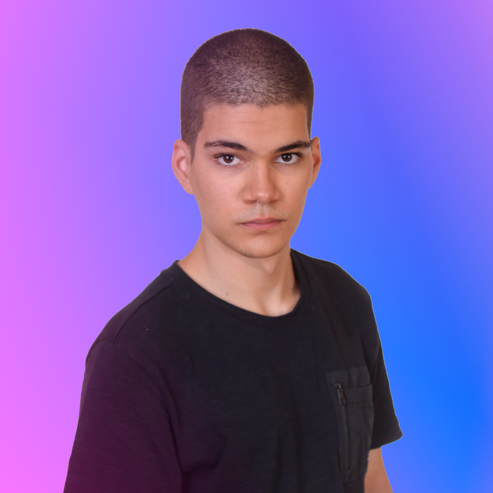

<p align="center">
<a href= "https://www.inteli.edu.br/"> </a>
</p>

# Violeta

A história do centenário Sírio-Libanês teve início com a reunião de um grupo de amigas sírio-libanesas que, como forma de retribuição pela hospitalidade que encontraram aqui ao migrarem da Síria a São Paulo, fundaram a Sociedade Beneficente de Senhoras e, posteriormente, o Hospital Sírio-Libanês. A figura responsável por liderar esse processo foi Adma Jafet, que coordenou o projeto do hospital por muito tempo. Para homenagear seu legado, tomamos a decisão unânime de nomear nossa equipe como “Violeta”, primeiro nome da filha de Adma Jafet, que também presidiu o Sírio-Libanês por décadas. 

## Integrantes

<div align="center">
  <table>
    <tr>
        <td align="center"><a href="https://www.linkedin.com/in/antonio-guimar%C3%A3es-2bb961264/?utm_source=share&utm_campaign=share_via&utm_content=profile&utm_medium=ios_app"><br><sub><b>Antônio Guim.</b></sub></a></td>
        <td align="center"><a href="https://github.com/danielquintaos/"><br><sub><b>Daniel Dávila</b></sub></a></td>
        <td align="center"><a href="https://www.linkedin.com/in/gabriel-gallo-m-coutinho-443809232/"><br><sub><b>Gabriel Gallo</b></sub></a></td>
        <td align="center"><a href="https://www.linkedin.com/in/gustavo-machado-esteves-453b81248/"><br><sub><b>Gustavo Mach.</b></sub></a></td>
        <td align="center"><a href="https://www.linkedin.com/in/laura-padilha-bueno-b358419a/"><br><sub><b>Laura Bueno</b></sub></a></td>
        <td align="center"><a href="https://www.linkedin.com/in/rafaelarojas/"><br><sub><b>Rafaela Rojas</b></sub></a></td>
        <td align="center"><a href="https://www.linkedin.com/in/raideoliveira/"><br><sub><b>Raí Cajé</b></sub></a></td>
    </tr>
  </table>
</div>

## Descrição 

📜| Projeto feito por alunos do Inteli - Instituto de Tecnologia e liderança - de Engenharia da Computação em parceria com o Hospital Sírio-Libanês. O projeto se trata de uma automatização no processo de montagem de carrinhos de emergência utilizado em situações necessárias, eliminando processos manuais e garantindo maior eficiência e otimização de tempo, uma resposta mais rápida e eficiente em casos de emergência.

A documentação do projeto pode ser encontrada [aqui](https://inteli-college.github.io/2024-T0008-EC05-G03/)

<br><br>
<p align="center">


<br><br>
<p align="center">


##  Estrutura de pastas

```
└── documentacao
│   ├── blog
│   ├── docs
|   │   ├── sprint-1
|   │   ├── sprint-2
|   │   ├── sprint-3 
|   │   ├── sprint-4 
|   │   └── sprint-5
│   ├── src
|   │   ├── components
|   │   ├── css
|   │   └── pages
│   └── static
├── slides
├── src
|   ├── backend
|   ├── database
|   ├── frontend
|   ├── micropython
|   └── pydobot
└──
```


## Inicialização

#### CLI (Command Line Interface)

- Abra o Terminal no seu VSCode, isso pode ser feito através do comando ```Ctrl + “```
- Digite a seguinte linha de comando:
```py src/main.py```
- Utilize as setas do teclado para navegar entre as opções e aperte ```Enter``` para selecionar, e então a interface por linha de comando estará pronta para usar.

#### Documentação

Siga passo a passo para inicializar a documentação:

- Abra o repositório em seu dispositivo e em seguida abra o terminal.
- Digite ```cd .\documentacao\``` para entrar na pasta referente.
- Digite ```npm i``` para instalar todas dependências.
- Por fim, digite ```npm start``` para inicializar o sistema.

> Para inicializar as demais partes do sistema, siga as instruções na respectiva seção da documentação, [disponível aqui](https://inteli-college.github.io/2024-T0008-EC05-G03/sprint-4/inicializacao).

## Histórico de lançamentos

- 0.1.0 - 16/02/2024
  - Entendimento do negócio
  - Arquitetura do sistema
  - UX Research
  - Guia de estilos
- 0.2.0 - 01/03/2024
  - Wireframe (baixa e alta fidelidade)
  - Mapeamento do fluxo de utilização da solução
  - CLI (Command Line Interface)
  - Sistema básico de automação
- 0.3.0 - 15/03/2024
  - Implementação de rotina de dupla verificação com sensor infravermelho
  - Mockup 
  - Inicio do backend (Rotas)
  - Inicio do frontend
- 0.4.0 - 28/03/2024
  - Integração entre backend e robô de braço mecânico
  - Desenvolvimento do frontend
  - Integração inicial entre frontend e backend
- 0.5.0 - 11/04/2024
  - Finalização da integração entre frontend e backend
  - Refinamento e ajustes na integração com o robô
  - Refinamento e ajustes na aplicação web
  - Testes de usabilidade

##  Licença/License

<p xmlns:cc="http://creativecommons.org/ns#" xmlns:dct="http://purl.org/dc/terms/"><a property="dct:title" rel="cc:attributionURL" href="https://github.com/Inteli-College/2024-T0008-EC05-G03">VIOLETA</a> by <a rel="cc:attributionURL dct:creator" property="cc:attributionName">Inteli, - <a href="https://www.linkedin.com/in/antonio-guimar%C3%A3es-2bb961264/?utm_source=share&utm_campaign=share_via&utm_content=profile&utm_medium=ios_app">Antonio Guimarães</a>, <a href="https://github.com/danielquintaos">Daniel Dávila</a>, <a href="https://www.linkedin.com/in/gabriel-gallo-m-coutinho-443809232/">Gabriel Gallo</a>, <a href="https://www.linkedin.com/in/gustavo-machado-esteves-453b81248/">Gustavo Machado</a>, <a href="https://www.linkedin.com/in/laura-padilha-bueno-b358419a/">Laura Bueno</a>, <a href="https://www.linkedin.com/in/rafaelarojas/">Rafaela Rojas</a>,  <a href="https://www.linkedin.com/in/raideoliveira/">Raí Cajé</a> </a> is licensed under <a href="http://creativecommons.org/licenses/by/4.0/?ref=chooser-v1" target="_blank" rel="license noopener noreferrer" style="display:inline-block;">Attribution 4.0 International</a>.</p>
