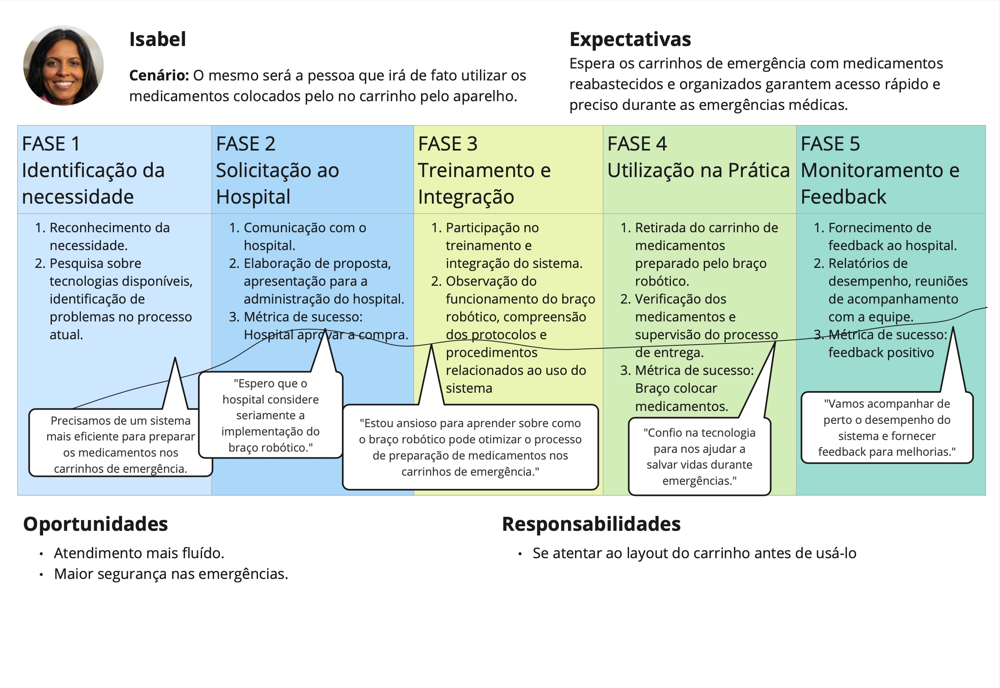
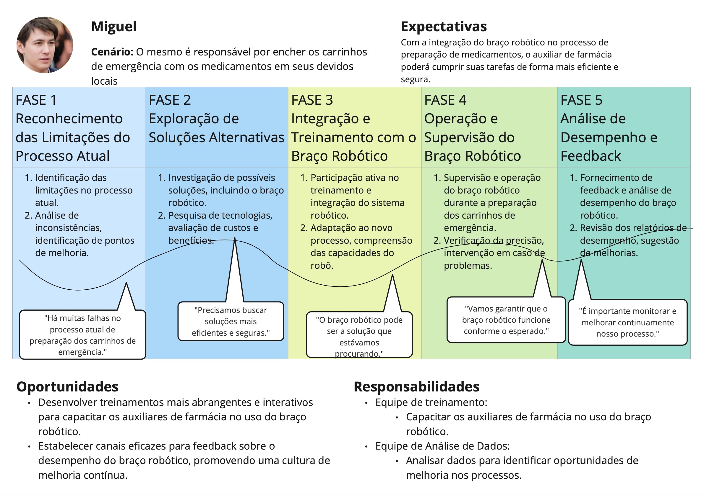

# Jornada do usuário

As "Jornadas do Usuário" são uma representação essencial no design de produtos e na experiência do usuário. Elas retratam o trajeto que uma persona percorre ao interagir com um produto ou serviço, desde o momento inicial de descoberta até a fase de utilização e além (feedback). Durante esse processo, o usuário experimenta uma série de diferentes emoções e pensamentos além de realizar diversas ações, que desempenham um papel crucial na percepção geral da experiência.

Essas jornadas são compostas por uma série de etapas ou estágios, que podem variar dependendo do produto ou serviço em questão. A cada etapa, o usuário pode enfrentar desafios, expectativas e necessidades específicas, moldando assim sua experiência e influenciando sua decisão de continuar ou abandonar o uso do produto, no nosso caso, sendo o braço mecânico. Compreender profundamente as jornadas do usuário permite  identificar pontos de atrito, oportunidades de melhoria e meios de proporcionar uma experiência mais satisfatória e eficiente aos futuros usuários.

**JORANDA DE USUARIO A CORRIGIR** 

Abaixo segue a Jornada de Usuário da médica, a mesma evidencia o surgimento da necessidade, todas as fases desde o surgimento do robo no hospital até os feedbacks referentes ao mesmo. Além de mostrar as expectativas, oportunidades e resposabilidades.

Figura 1 - Jornada de Usuário referente a médica

Fonte: Elaboração própria

Abaixo segue a Jornada de Usuário do auxiliar de farmácia com as características referentes ao mesmo.

Figura 2 - Jornada de Usuário referente ao auxiliar de farmácia

Fonte: Elaboração própria

Por fim, as jornadas do usuário são uma ferramenta fundamental para o desenvolvimento de produtos centrados no usuário. Ao mapear e entender o caminho que os usuários percorrem, podem ser criadas soluções mais eficazes e orientadas para atender às necessidades e expectativas dos usuários em todas as fases do ciclo de vida do produto. Isso não apenas aumenta a satisfação do usuário, mas também contribui para o sucesso e a relevância contínua do produto.

