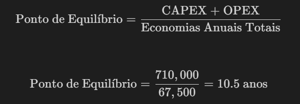

# Análise financeira

##### Análise financeira elaborada no processo de entendimento de negócio do projeto

&nbsp;&nbsp;&nbsp;&nbsp;Esta análise transcende a esfera numérica para questionar como o investimento em automação pode simultaneamente otimizar a gestão de recursos e elevar a qualidade do cuidado ao paciente, buscando um equilíbrio entre o imperativo econômico e a missão humanitária da medicina. Ao calcular o ponto de equilíbrio, não miramos apenas um objetivo financeiro, mas reconhecemos esse limiar como um passo fundamental na jornada contínua de inovação e melhoria no cuidado à saúde, almejando harmonizar a eficácia operacional com a sustentabilidade econômica e o comprometimento com o bem-estar do paciente.
&nbsp;&nbsp;&nbsp;&nbsp;Valores estimados em USD. Dados acessados em fevereiro de 2024.

## Investimento

### 1. Custos Iniciais (CAPEX)

**Desenvolvimento do Sistema:**

- **Pesquisa e Desenvolvimento (R&D):** Inclui o custo de pesquisa para entender as necessidades específicas, tecnologias envolvidas e a melhor abordagem para a automação. Estimativa: $50,000 - $100,000.
- **Software:** Desenvolvimento do software de automação, incluindo a customização para diferentes layouts de carrinhos e o rastreamento de itens. Estimativa: $150,000 - $300,000.
- **Hardware:** Aquisição de equipamentos automatizados, como robôs, scanners e sistemas de rastreamento. Estimativa: $200,000 - $500,000.

**Infraestrutura e Implementação:**

- **Adaptação de Infraestrutura:** Modificações no ambiente hospitalar para acomodar o novo sistema. Estimativa: $20,000 - $50,000.
- **Treinamento:** Capacitação da equipe para operar o novo sistema. Estimativa: $10,000 - $20,000.
- **Testes e Ajustes:** Fase de testes para garantir a operacionalidade do sistema. Estimativa: $5,000 - $15,000.

**Total Estimado do CAPEX:** $435,000 - $985,000.

### 2. Custos Operacionais (OPEX)

**Manutenção e Suporte:**

- **Manutenção do Hardware:** Custos regulares de manutenção dos equipamentos. Estimativa anual: $10,000 - $30,000.
- **Atualizações de Software:** Manutenção e atualização do software. Estimativa anual: $20,000 - $40,000.

**Operação:**

- **Energia e Suprimentos:** Custos de energia para operar os equipamentos e custos de suprimentos adicionais necessários. Estimativa anual: $5,000 - $10,000.
- **Pessoal:** Salários da equipe dedicada à operação e supervisão do sistema. Estimativa anual: $50,000 - $100,000.

**Total Estimado do OPEX (anual):** $85,000 - $180,000.

## Retorno

&nbsp;&nbsp;&nbsp;&nbsp;Para fornecer uma análise abrangente das economias associadas à implementação de um projeto de automação hospitalar para a montagem de carrinhos de emergência após um ano, serão detalhados possíveis tipos de economia que o projeto pode gerar. Essas economias podem ser derivadas da redução de custos operacionais, aumento da eficiência, redução de erros e desperdícios, e aprimoramento da gestão de inventário.

### 1. Economia com Mão de Obra

**Redução de Horas de Trabalho Necessárias:**

- **Antes da Automação:** Considerando operações manuais extensas para montagem de carrinhos.
- **Após Automação:** Redução significativa do tempo necessário por tarefa devido à eficiência do sistema automatizado.
- **Estimativa de Economia:** Considerando uma redução de 30-50% no tempo de mão de obra, isso pode se traduzir em economias de $20,000 - $50,000 anuais, dependendo dos salários e do número de funcionários afetados.

### 2. Redução de Erros e Desperdícios

**Minimização de Erros de Montagem:**

- **Custo dos Erros:** Inclui desperdício de materiais e necessidade de remontagem.
- **Economia:** A precisão da automação reduz os erros significativamente.
- **Estimativa de Economia:** $5,000 - $15,000 anuais, considerando os custos de materiais desperdiçados e retrabalho.

### 3. Economia de Tempo

**Redução no Tempo de Montagem:**

- **Impacto:** Tempo de resposta mais rápido em situações de emergência e melhor disponibilidade de carrinhos.
- **Valorização:** Embora seja difícil quantificar em termos monetários, a economia de tempo contribui para a eficácia operacional e pode ter um impacto positivo na qualidade do atendimento ao paciente.

### 4. Gestão de Inventário

**Otimização de Estoque:**

- **Redução de Estoque Excessivo:** A automação permite um controle de inventário mais preciso, reduzindo a necessidade de estoque excessivo.
- **Estimativa de Economia:** $10,000 - $20,000 anuais, através da redução de capital imobilizado em inventário.

### 5. Manutenção e Atualizações

**Redução nos Custos de Manutenção:**

- **Antes da Automação:** Custos mais altos com manutenção manual e ajustes frequentes.
- **Após Automação:** Embora haja custos de manutenção para o sistema automatizado, a longo prazo, a confiabilidade e eficiência do sistema podem reduzir esses custos.
- **Estimativa de Economia:** $5,000 - $10,000 anuais, considerando a redução na necessidade de manutenção emergencial e reparos.

### Total Estimado de Economias

&nbsp;&nbsp;&nbsp;&nbsp;Somando todas as economias potenciais, podemos estimar uma economia total no intervalo de **$40,000 - $95,000 anuais**. Esta estimativa é altamente dependente das condições específicas do hospital, incluindo o tamanho da operação, o custo da mão de obra local, a eficiência do sistema implementado, e a escala do desperdício e dos erros antes da automação.

## Ponto de Equilíbrio

Para calcular o ponto de equilíbrio do projeto de automação hospitalar, precisaremos determinar o momento em que as economias geradas pelo projeto igualam os custos iniciais de implementação. Vamos usar as estimativas de custos iniciais (CAPEX) e as economias anuais (OPEX reduzido e outras economias) fornecidas anteriormente.

- **Custos Iniciais (CAPEX):** Vamos assumir um valor médio dentro da faixa estimada, por exemplo, $710,000 (considerando o meio da faixa de $435,000 a $985,000).
- **Economias Anuais Totais:** Assumindo um valor médio dentro da faixa estimada, por exemplo, $67,500 (considerando o meio da faixa de $40,000 a $95,000).

Figura 1 - Expressões de cálculo do ponto de equilíbrio

Fonte: Elaboração própria

## Conclusão

&nbsp;&nbsp;&nbsp;&nbsp;A análise financeira preliminar sugere um investimento inicial considerável, mas com potencial para eficiências operacionais significativas e redução de custos a longo prazo. A viabilidade financeira final dependerá da capacidade do sistema em atingir os benefícios esperados e na gestão eficaz dos custos operacionais.

&nbsp;&nbsp;&nbsp;&nbsp;Essa análise foi baseada em estimativas e pode variar de acordo com os fornecedores específicos, soluções tecnológicas escolhidas e a complexidade do ambiente hospitalar onde o sistema será implementado. Recomenda-se uma avaliação detalhada, incluindo solicitações de propostas (RFPs) de fornecedores e a consulta com especialistas em automação hospitalar para refinar essas estimativas.
