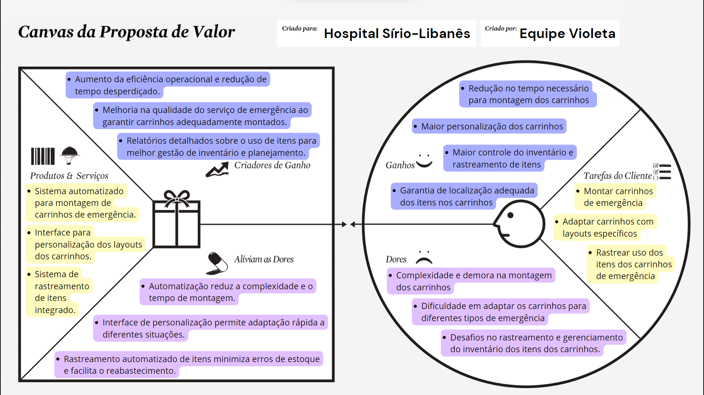

# Value Proposition Canva

##### Canvas de proposta de valor elaborado no processo de entendimento de negócio do projeto

&nbsp;&nbsp;&nbsp;&nbsp;No âmbito da análise estratégica, o Value Proposition Canvas é uma ferramenta essencial, concebida para aprimorar a articulação e entrega da proposta de valor das empresas aos seus clientes. Este modelo analítico, desenvolvido para detalhar a correspondência entre as ofertas de uma empresa e as necessidades de seus clientes, divide-se em duas seções principais: Perfil do Cliente (Customer Profile) e Proposição de Valor (Value Proposition). Tal estrutura permite às organizações identificar e endereçar as necessidades não satisfeitas e as dores dos clientes de forma precisa, facilitando a criação de ofertas que geram valor significativo. Segundo Michael Porter, o alinhamento eficaz entre as capacidades da empresa e as demandas do mercado é crucial para sustentar vantagens competitivas, sendo o Value Proposition Canvas um instrumento chave nesse processo de alinhamento estratégico.

Figura 1 - Value Proposition Canvas (Canvas da Proposta de Valor)

Fonte: Elaboração própria

1. **Segmentos de Clientes**:
   - Hospitais e clínicas que utilizam carrinhos de emergência.
   - Equipes de emergência que lidam com a montagem e utilização dos carrinhos.

2. **Tarefas do Cliente**:
   - Montar carrinhos de emergência de forma rápida e eficaz.
   - Adaptar os carrinhos a diferentes situações de emergência com layouts específicos.
   - Rastrear o uso dos itens dentro dos carrinhos para reabastecimento.

3. **Dores do Cliente**:
   - Complexidade e demora na montagem dos carrinhos.
   - Dificuldade em adaptar os carrinhos para diferentes tipos de emergência.
   - Desafios no rastreamento e no gerenciamento do inventário dos itens dos carrinhos.

4. **Ganhos Esperados**:
   - Redução no tempo necessário para montar os carrinhos de emergência.
   - Maior flexibilidade e personalização dos carrinhos para diferentes necessidades.
   - Melhoria no controle de inventário e no rastreamento de itens, facilitando o reabastecimento.
   - Garantia de que todos os medicamentos e equipamentos estarão nos locais adequados.

### Proposição de Valor (Value Proposition)

1. **Produtos e Serviços**:
   - Sistema automatizado para montagem de carrinhos de emergência.
   - Interface para personalização dos layouts dos carrinhos.
   - Sistema de rastreamento de itens integrado.

2. **Aliviadores de Dor**:
   - Automatização reduz a complexidade e o tempo de montagem.
   - Interface de personalização permite adaptação rápida a diferentes situações.
   - Rastreamento automatizado de itens minimiza erros de estoque e facilita o reabastecimento.

3. **Criadores de Ganhos**:
   - Aumento da eficiência operacional e redução de tempo desperdiçado.
   - Melhoria na qualidade do serviço de emergência ao garantir carrinhos adequadamente montados.
   - Relatórios detalhados sobre o uso de itens para melhor gestão de inventário e planejamento.

### Conclusão

&nbsp;&nbsp;&nbsp;&nbsp;Tendo em mente os fatos mencionados, é possível concluir que a proposta avulta-se como um paradigma de inovação estratégica, cuja implementação não apenas subverte os tradicionais paradigmas de montagem de carrinhos de emergência, mas também rearticula os axiomas fundamentais da competitividade hospitalar. Através desta iniciativa, delineia-se um horizonte onde a eficácia operacional e a customização de serviços convergem para a promoção de um atendimento de emergência mais ágil e adaptado às exigências contemporâneas, ancorado em uma visão estratégica que harmoniza tecnologia, gestão e cuidado ao paciente, em uma episteme onde a inovação se erige como o fulcro da vantagem competitiva sustentável.
