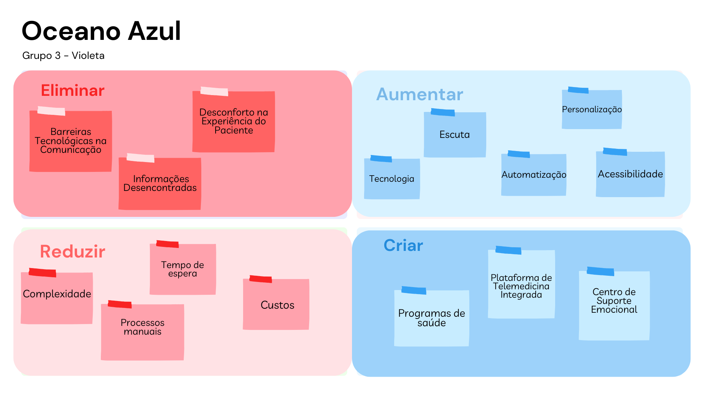
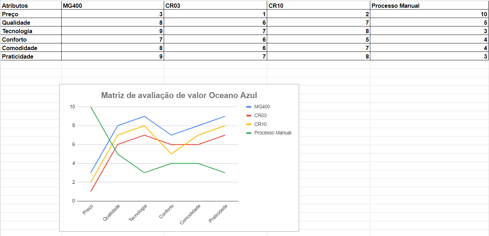

# Matriz Oceano Azul

##### Matriz de oceano azul elaborada no processo de entendimento de negócio do projeto

&nbsp;&nbsp;&nbsp;&nbsp;Uma matriz de oceano azul é uma ferramenta estratégica concebida para orientar as organizações na busca de inovação e crescimento sustentável em seus mercados. É uma abordagem inovadora para a criação de espaços de mercado inexplorados e desvinculados da competição direta.

&nbsp;&nbsp;&nbsp;&nbsp;Ao contrário do oceano vermelho, que representa mercados saturados e altamente competitivos, o oceano azul simboliza novas oportunidades e segmentos de mercado onde a concorrência é irrelevante ou inexistente. A matriz de oceano azul fornece um quadro estruturado para as empresas identificarem e explorarem esses nichos, permitindo que se afastem da competição direta e criem novos espaços de mercado.
A matriz é composta por quatro quadrantes, cada um representando uma abordagem estratégica diferente:

- Eliminar (Eliminate): Identificar e eliminar elementos do setor que são tradicionais e dispensáveis, focando apenas no que é essencial.
- Reduzir (Reduce): Reduzir a ênfase em áreas menos valorizadas pelos clientes, otimizando custos sem comprometer a qualidade percebida.
- Aumentar (Raise): Concentrar esforços em aspectos do produto ou serviço que são valorizados pelos clientes, elevando seu padrão acima do convencional.
- Criar (Create): Introduzir novos elementos ou características que ainda não estão presentes no mercado, proporcionando um valor inédito aos consumidores.

### Análise Oceano Azul
  
&nbsp;&nbsp;&nbsp;&nbsp;A seguir, tem-se a análise de oceano azul aplicada ao parceiro de projeto, Sírio-Libanes.

Figura 1 - Esquema visual da análise de oceano azul referente ao projeto

Fonte: Elaboração própria

&nbsp;&nbsp;&nbsp;&nbsp;***Reduzir***:

- **Tempo de Espera para Atendimento Emergencial**:
  - **Estratégia**: Implementar um sistema de triagem eficiente e otimizar a alocação de recursos para reduzir o tempo de espera em situações de emergência.
  - **Indicadores de Desempenho**: Tempo médio de atendimento de emergência; percentual de pacientes atendidos dentro do prazo estabelecido.
- **Complexidade na Marcação de Consultas**:
  - **Estratégia**: Desenvolver uma plataforma online intuitiva e simplificada para agendamento de consultas, integrada ao histórico do paciente.
  - **Indicadores de Desempenho**: Tempo médio para marcar uma consulta; taxa de sucesso na marcação online.
- **Custos Administrativos**:
  - **Estratégia**: Revisar processos internos, adotar tecnologias de automação e simplificar a burocracia para reduzir custos administrativos.
  - **Indicadores de Desempenho**: Redução percentual nos custos administrativos; eficiência no processamento de transações.
- **Processos muito manuais**
  - **Estratégia**: Automatizar alguns processos para gerar eficiência e ganho de tempo para emergências.
  - **Indicadores de Desempenho**: Emergências sendo atendidas mais rápidamente, maior quantidade de emergências atendidas em menos tempo.
  
&nbsp;&nbsp;&nbsp;&nbsp;***Eliminar***:

- **Desconforto na Experiência do Paciente**:
  - **Estratégia**: Investir em melhorias na infraestrutura, treinamento de equipe para atendimento humanizado e coleta de feedback constante.
  - **Indicadores de Desempenho**: Índice de satisfação do paciente; tempo médio de resposta a reclamações.
- **Informações Desencontradas**:
  - **Estratégia**: Implementar um sistema integrado de informações para garantir consistência entre diferentes setores.
  - **Indicadores de Desempenho**: Precisão das informações compartilhadas; redução de retrabalho devido a dados inconsistentes.
- **Barreiras Tecnológicas na Comunicação**:
  - **Estratégia**: Adotar plataformas de comunicação eficientes, treinar a equipe para sua utilização e promover a aceitação entre pacientes e parceiros.
  - **Indicadores de Desempenho**: Taxa de adoção de plataformas de comunicação; melhoria na eficiência da comunicação.

&nbsp;&nbsp;&nbsp;&nbsp;***Aumentar***:

- **Personalização no Atendimento**:
  - **Estratégia**: Utilizar tecnologias de análise de dados para personalizar o atendimento, considerando o histórico médico e preferências individuais.
  - **Indicadores de Desempenho**: Nível de personalização alcançado; feedback positivo dos pacientes.
- **Acessibilidade de Informações**:
  - **Estratégia**: Desenvolver uma plataforma de informações acessível, com conteúdo educativo sobre saúde, procedimentos e serviços.
  - **Indicadores de Desempenho**: Taxa de utilização da plataforma; compreensão das informações pelos usuários.
- **Tecnologia para Diagnósticos Precisos**:
  - **Estratégia**: Investir em equipamentos e sistemas de última geração para garantir diagnósticos rápidos e precisos.
  - **Indicadores de Desempenho**: Tempo médio para diagnóstico; precisão dos resultados.
- **Escuta de reclamações**
  - **Estratégia**: Atender mais reclamações em SAC ou sites como Reclame Aqui.
  - **Indicadores de Desempenho**: Aumento percentual nas respostas de reclamações, mai reclamações resolvidas ou diminuição no número de reclamações.
- **Automatização de processos manuais**:
  - **Estratégia**: Investir em automatização de processos que demandam um longo período de tempo e geram atraso.
    - **Indicadores de Desempenho**: Diminuição de tempo em processos.

&nbsp;&nbsp;&nbsp;&nbsp;***Criar***:

- **Programas de Saúde Preventiva Personalizados**:
  - **Estratégia**: Desenvolver programas específicos de prevenção, integrando tecnologias para monitoramento e incentivo à adoção de hábitos saudáveis.
  - **Indicadores de Desempenho**: Participação nos programas preventivos; melhoria nos indicadores de saúde preventiva.
- **Plataforma de Telemedicina Integrada**:
  - **Estratégia**: Implementar uma plataforma abrangente de telemedicina para consultas virtuais, monitoramento remoto e emissão de prescrições online.
  - **Indicadores de Desempenho**: Número de consultas virtuais realizadas; satisfação dos pacientes com a telemedicina.
- **Centro de Suporte Emocional**:
  - **Estratégia**: Criar um centro dedicado ao suporte emocional, com profissionais especializados e recursos para acompanhamento durante todo o ciclo de tratamento.
  - **Indicadores de Desempenho**: Utilização do centro de suporte emocional; melhoria na qualidade de vida percebida pelos pacientes e familiares.

### Tecnologia e Matriz de Oceano Azul

Figura 2 - Matriz de oceano azul referente ao projeto

Fonte: Elaboração própria

&nbsp;&nbsp;&nbsp;&nbsp;Inicialmente, é de importante destacar que a matriz de oceano azul acima visa realizar uma análise quantitativa em relação a possíveis tecnologias que podem ser utilizadas para a automação alvo do Sírio-Libanês. É necessário destacar também, que a tranformação em uma análise quantitativa foi feita tomando como base os documentos que podem ser encontrados [aqui](https://drive.google.com/drive/folders/1AgG_qLSkDvK4uzXCPOZHy4Xjx8X4qp96?usp=sharing), além de pesquisas observando o contexto industrial inserido.

&nbsp;&nbsp;&nbsp;&nbsp;A decisão de automatizar o processo de montagem de carrinhos de emergência no Hospital Sírio Libanês é uma medida estratégica que visa otimizar diversos aspectos relacionados a esse procedimento vital para o atendimento eficiente em situações críticas. Para entendermos as razões por trás dessa escolha, é fundamental analisar detalhadamente cada um dos atributos mencionados: Preço, Qualidade, Tecnologia, Conforto, Comodidade e Praticidade.

- **Preço**: O custo de implementação desempenha um papel crucial na escolha da automatização. O MR400, com seu preço acessível de 30.000, destaca-se como uma opção economicamente viável para a instituição de saúde. Por outro lado, o CR03 e o CR10, com custos mais elevados de 160.000 e 250.000, respectivamente, apresentam desafios financeiros significativos. A pontuação atribuída reflete a preferência por uma solução mais acessível, recebendo uma pontuação mais alta. É necessário entender que, o MR400 é mais acessível, entretando possui algumas limitações, todavia, analisando o projeto, ele cumpre o que é preciso para a automatização no processo de montagem dos carrinhos de emergência.

- **Qualidade**: A qualidade na montagem dos carrinhos de emergência é uma preocupação primordial, uma vez que afeta diretamente a segurança e eficácia do atendimento médico. A automatização com o MR400 obtém uma pontuação alta de 8, indicando uma confiança na precisão e consistência da montagem automatizada. Enquanto o CR03 e o CR10 oferecem qualidade, a pontuação reflete uma preferência pelo sistema automatizado por sua consistência superior.

- **Tecnologia**: A sofisticação tecnológica é um aspecto crucial na modernização de processos hospitalares. O MR400, com uma pontuação de 9, destaca-se como uma solução de alta tecnologia, capaz de integrar-se perfeitamente ao ambiente hospitalar. Os concorrentes CR03 e CR10 também apresentam tecnologia avançada, mas a pontuação reflete a preferência pela solução mais avançada.

- **Conforto**: O conforto dos profissionais de saúde envolvidos na montagem é uma consideração significativa. A pontuação mais alta para o MR400, com 7, sugere que a automatização deste processo é menos desgastante para os operadores. A ergonomia do processo é valorizada para garantir um ambiente de trabalho saudável e eficiente.

- **Comodidade**: A facilidade de integração da solução no ambiente hospitalar é vital. O MR400, com uma pontuação de 8, destaca-se por sua capacidade de se adaptar suavemente ao contexto do Hospital Sírio Libanês. A comodidade na transição para uma nova metodologia de montagem é essencial para garantir a continuidade operacional sem interrupções significativas.

- **Praticidade**: A praticidade engloba a eficiência e simplicidade do processo, e o MR400 destaca-se novamente com uma pontuação de 9. A automação reduz significativamente o tempo necessário para a montagem, proporcionando uma eficiência notável. A praticidade é vital, especialmente em ambientes hospitalares, onde cada minuto conta.

&nbsp;&nbsp;&nbsp;&nbsp;Considerando o contexto do Hospital Sírio Libanês, onde o tempo é crítico em situações de emergência, a automação do processo de montagem dos carrinhos oferece uma vantagem incontestável. O processo manual, com uma duração aproximada de 50 minutos, pode ser significativamente reduzido com a implementação de um sistema automatizado. Essa redução no tempo de montagem é crucial para garantir uma resposta mais rápida e eficiente em casos de emergência.

&nbsp;&nbsp;&nbsp;&nbsp;Além disso, a presença de falhas humanas no processo manual é uma preocupação séria, já que pode comprometer a qualidade e a confiabilidade dos carrinhos de emergência. A automação minimiza essas falhas, proporcionando uma consistência e precisão que são essenciais em ambientes hospitalares, onde a integridade e a eficácia dos equipamentos médicos são de suma importância.

---

## Bibliografia

Blue Ocean – more success with the right strategy. Disponível em: https://www.ionos.com/startupguide/get-started/blue-ocean-strategy/.

SYDLE. Automação hospitalar: o que é e quais são os benefícios? Disponível em: https://www.sydle.com/br/blog/automacao-hospitalar-63d28b3af467593bde10daed.

DOBOT MG400 Robotic Arm | Adaptable for Small Batch Production. Disponível em: https://www.dobot-robots.com/products/desktop-four-axis/mg400.html.

SUMAART.COM. DOBOT CR3 Robotic Arm | Lightweight Cobot for Flexible Manufacturing Automation. Disponível em: https://www.dobot-robots.com/products/cr-series/cr3.html.

SUMAART.COM. DOBOT CR10 Robotic Arm | Reliable Cobot with Wide Working Radius. Disponível em: https://www.dobot-robots.com/products/cr-series/cr10.html.

SUMAART.COM. Cobot in Medical Industry | Dobot Industries. Disponível em: https://www.dobot-robots.com/industries/medical.html#:~:text=Dobot

SUMAART.COM. 3 Powerful Ways to Deploy Robotic Arms in Healthcare Industry. Disponível em: https://www.dobot-robots.com/insights/news/3-powerful-ways-to-deploy-robotic-arms-in-healthcare-industry.html

Reclame Aqui - Sírio-Libanês. Disponível em: https://www.reclameaqui.com.br/empresa/hospital-sirio-libanes-sp/lista-reclamacoes/
