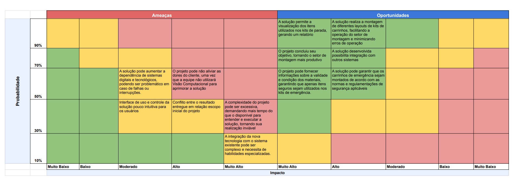

# Matriz de Risco

##### Matriz de risco elaborada no processo de entendimento de negócio do projeto

&nbsp;&nbsp;&nbsp;&nbsp;A matriz de riscos é uma ferramenta fundamental na análise de negócios que consiste em uma tabela onde os riscos são enumerados nas linhas, enquanto os impactos e probabilidades são indicados nas colunas. Ao preencher as células da matriz com informações sobre a gravidade do risco (impacto) e a probabilidade de ocorrência, a organização consegue identificar quais riscos são os mais críticos e quais demandam maior atenção e alocação de recursos para serem gerenciados.

&nbsp;&nbsp;&nbsp;&nbsp;Essa ferramenta em questão, é essencial na avaliação e gestão de riscos em projetos ou implementações, pois uma matriz bem elaborada permite à equipe priorizar os riscos mais críticos, facilitando a implementação de medidas preventivas e corretivas adequadas, o que reduz os possíveis impactos negativos. Então, tendo como base de análise as particularidades da equipe e do projeto em questão, a seguir está uma análise de riscos específica para esta solução.

Figura 1 - Matriz de risco referente ao projeto

Fonte: Elaboração própria

&nbsp;&nbsp;&nbsp;&nbsp;Também, disponibiliza-se a transcrição dos textos inseridos na matriz:

&nbsp;&nbsp;&nbsp;&nbsp;
***Riscos Potenciais***:

- O custo da implementação da solução pode tornar a aplicação do projeto inviável ( Probabilidade: Alta 70% x Impacto: Muito alto)
- A solução pode aumentar a dependência de sistemas digitais e tecnológicos, podendo ser problemático em caso de falhas ou interrupções ( Probabilidade: Média 50% x Impacto: Médio)
- O projeto pode não aliviar as dores do cliente, uma vez que a equipe não utilizará Visão Computacional para aprimorar a solução ( Probabilidade: Média 50% x Impacto: Alto)

- Interface de uso e controle da solução pouco intuitiva para os usuários ( Probabilidade: Baixa 30% x Impacto: Moderado)

- Conflito entre o resultado entregue em relação ao escopo inicial do projeto ( Probabilidade: Baixa 30% x Impacto: Alto)

- A complexidade do projeto pode ser excessiva, demandando mais tempo do que o disponível para entender e executar a solução, tornando sua realização inviável ( Probabilidade: Baixa 30% x Impacto: Muito Alto)

- A integração da nova tecnologia com o sistema existente pode ser complexo e necessita de habilidades especializadas ( Probabilidade: Muito baixa 10% x Impacto: Alto)

&nbsp;&nbsp;&nbsp;&nbsp;
***Riscos Reais***:

- A solução permite a visualização dos itens utilizados nos kits de parada, gerando um relatório ( Probabilidade: Muito Alta 90% x Impacto: Muito Alto)

- A solução realiza a montagem de diferentes layouts de kits de carrinhos, facilitando a operação do setor de montagem e minimizando erros de operação ( Probabilidade: Muito Alta 90% x Impacto: Alto)

- O projeto concluiu seu objetivo, tornando o setor de montagem mais produtivo (Probabilidade: Alta 70% x Impacto: Muito Alto)

- A solução desenvolvida possibilita integração com outros sistemas ( Probabilidade: Alta 70% x Impacto: Alto)

- O projeto pode fornecer informações sobre a validade e condição dos materiais, garantindo que apenas itens seguros sejam utilizados nos kits de emergência ( Probabilidade: Média 50% x Impacto: Muito Alto)

- A solução pode garantir que os carrinhos de emergência sejam montados de acordo com as normas e regulamentações de segurança aplicáveis ( Probabilidade: Média 50% x Impacto: Alto)

&nbsp;&nbsp;&nbsp;&nbsp;
***Plano de Ação e Resposta***:

1. O custo da implementação da solução pode tornar a aplicação do projeto inviável
    - Plano de Ação: A equipe deverá realizar uma análise detalhada dos custos envolvidos na implementação da solução, considerando todas as etapas do projeto, identificando, também, oportunidades de otimização de custos e buscar alternativas mais econômicas, como a utilização de tecnologias ou recursos já disponíveis.
    - Resposta ao Risco: Se torna necessário manter um controle rigoroso dos custos ao longo do projeto, realizando revisões periódicas para garantir que estejam dentro do orçamento planejado.

2. A solução pode aumentar a dependência de sistemas digitais e tecnológicos, podendo ser problemático em caso de falhas ou interrupções
    - Plano de Ação: Torna-se necessário realizar uma análise de impacto das possíveis falhas nos sistemas digitais e tecnológicos e desenvolver um plano de contingência para lidar com essas situações, sendo uma possibilidade investir em redundância e sistemas de backup para minimizar o impacto de interrupções.
    - Resposta ao Risco: Implementar práticas de monitoramento e manutenção preventiva dos sistemas digitais e tecnológicos para identificar e corrigir problemas antes que causem interrupções significativas, significa estar preparado para responder rapidamente a falhas e minimizar seu impacto.

3. O projeto pode não aliviar as dores do cliente, uma vez que a equipe não utilizará Visão Computacional para aprimorar a solução
    - Plano de Ação: É recomendado realizar uma análise detalhada das necessidades do cliente e do mercado para garantir que a solução proposta atenda às expectativas e alivie as dores do cliente. Também, a equipe pode explorar alternativas para incorporar elementos de Visão Computacional, se viável e necessário, durante o desenvolvimento do projeto.
    - Resposta ao Risco: Torna-se crucial estabelecer uma comunicação clara com o cliente desde o início para garantir que suas expectativas sejam alinhadas com a solução proposta.

4. Interface de uso e controle da solução pouco intuitiva para os usuários
    - Plano de Ação: A realização de testes de usabilidade e design iterativo da interface se torna imprescindível, uma vez que serve para garantir que seja intuitiva e fácil de usar.
    - Resposta ao Risco: Priorizar a experiência do usuário como um aspecto fundamental do projeto, portanto, designar recursos para refinamento contínuo da interface com base no feedback dos usuários durante todo o ciclo de desenvolvimento é um requisito para mitigar essa ameaça.

5. Conflito entre o resultado entregue em relação ao escopo inicial do projeto
    - Plano de Ação: Estabelecer uma comunicação clara com o cliente desde o início para definir e documentar o escopo do projeto e realizar revisões periódicas do escopo, garantindo sua conformidade e evitando conflitos.
    - Resposta ao Risco: Documentar todas as mudanças no escopo, obter aprovação do cliente e, então, implementá-las é uma alternativa para conter esse risco.

6. A complexidade do projeto pode ser excessiva, demandando mais tempo do que o disponível para entender e executar a solução, tornando sua realização inviável
    - Plano de Ação: Utilizando o método Scrum, a equipe deve dividir o projeto em fases ou etapas menores e mais gerenciáveis, ou seja, sprints, facilitando, assim, o desenvolvimento impecável da solução
    - Resposta ao Risco: O Scrum Master deve monitorar de perto o progresso do projeto e estar preparado para realocar recursos ou reavaliar prazos conforme necessário para mitigar a complexidade. Também, para garantir a qualidade e a viabilidade técnica do projeto, torna-se necessário implementar processos de revisão de design e código.

7. A integração da nova tecnologia com o sistema existente pode ser complexa e necessita de habilidades especializadas
    - Plano de Ação: Realizar uma análise detalhada dos requisitos de integração e identificar as habilidades necessárias para sua realização.
    - Resposta ao Risco: Estabelecer uma comunicação clara com a equipe responsável pela integração garante que todos os requisitos e expectativas sejam compreendidos.
