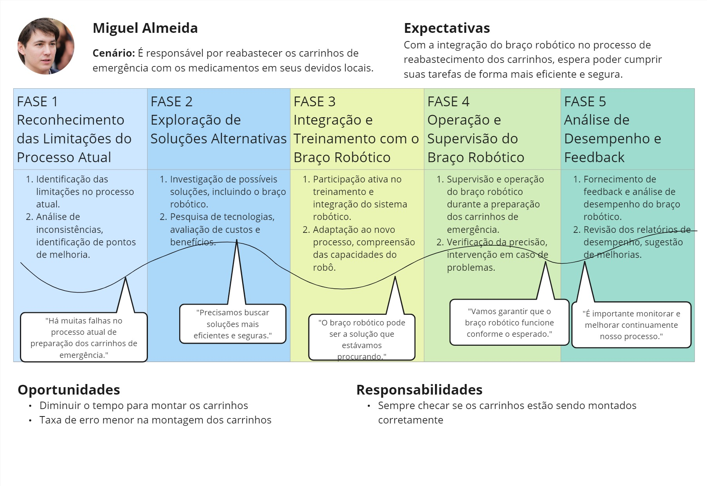
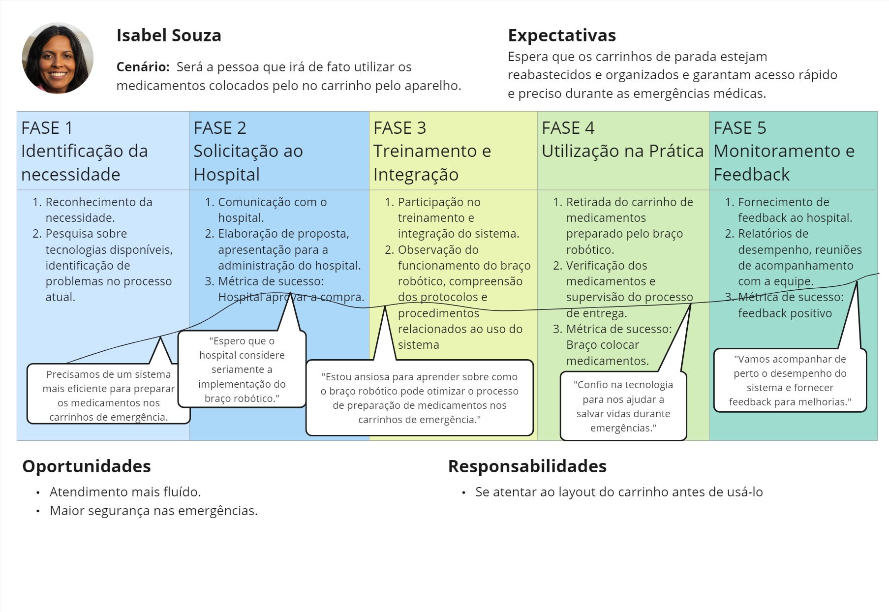

# Jornada do usuário

##### Jornadas de usuário elaboradas no processo de UX research do projeto

&nbsp;&nbsp;&nbsp;&nbsp;As "Jornadas do Usuário" são uma representação essencial no design de produtos e na experiência do usuário. Elas retratam o trajeto que uma persona percorre ao interagir com um produto ou serviço, desde o momento inicial de descoberta até a fase de utilização e além (feedback). Durante esse processo, o usuário experimenta uma série de diferentes emoções e pensamentos além de realizar diversas ações, que desempenham um papel crucial na percepção geral da experiência.

&nbsp;&nbsp;&nbsp;&nbsp;Essas jornadas são compostas por uma série de etapas ou estágios, que podem variar dependendo do produto ou serviço em questão. A cada etapa, o usuário pode enfrentar desafios, expectativas e necessidades específicas, moldando assim sua experiência e influenciando sua decisão de continuar ou abandonar o uso do produto que, no nosso caso, é um braço mecânico usado para automatizar o reabastecimento de carrinhos de parada. Compreender profundamente as jornadas do usuário permite identificar pontos de atrito, oportunidades de melhoria e meios de proporcionar uma experiência mais satisfatória e eficiente aos futuros usuários.

&nbsp;&nbsp;&nbsp;&nbsp;Abaixo, segue a jornada de usuário do auxiliar de farmácia. A mesma evidencia o surgimento de uma necessidade a partir de um problema e todas as fases desde a implantação do robô no hospital como solução até os feedbacks referentes a este. Além de mostrar as expectativas, oportunidades e resposabilidades.

Figura 1 - Jornada de usuário referente ao auxiliar de farmácia

Fonte: Elaboração própria

&nbsp;&nbsp;&nbsp;&nbsp;Abaixo, segue a jornada de usuário da médica com as características referentes à mesma.

Figura 2 - Jornada de usuário referente à médica

Fonte: Elaboração própria

&nbsp;&nbsp;&nbsp;&nbsp;A partir da jornada do usuário acima, foi possível concluir que entender o percurso do usuário é essencial para o desenvolvimento de produtos centrados no usuário. Ao mapear e compreender as etapas que os usuários percorrem, podemos criar soluções mais eficazes e direcionadas para atender às suas necessidades e expectativas em todas as fases do ciclo de vida do produto.

&nbsp;&nbsp;&nbsp;&nbsp;Essa abordagem não só aumenta a satisfação do usuário, mas também contribui significativamente para o sucesso e a relevância contínua do produto no mercado. Ao alinhar as estratégias de desenvolvimento com as experiências reais dos usuários, as jornadas do usuário tornam-se uma poderosa ferramenta para orientar o desenvolvimento de produtos que realmente agregam valor e impacto positivo na vida dos usuários.
