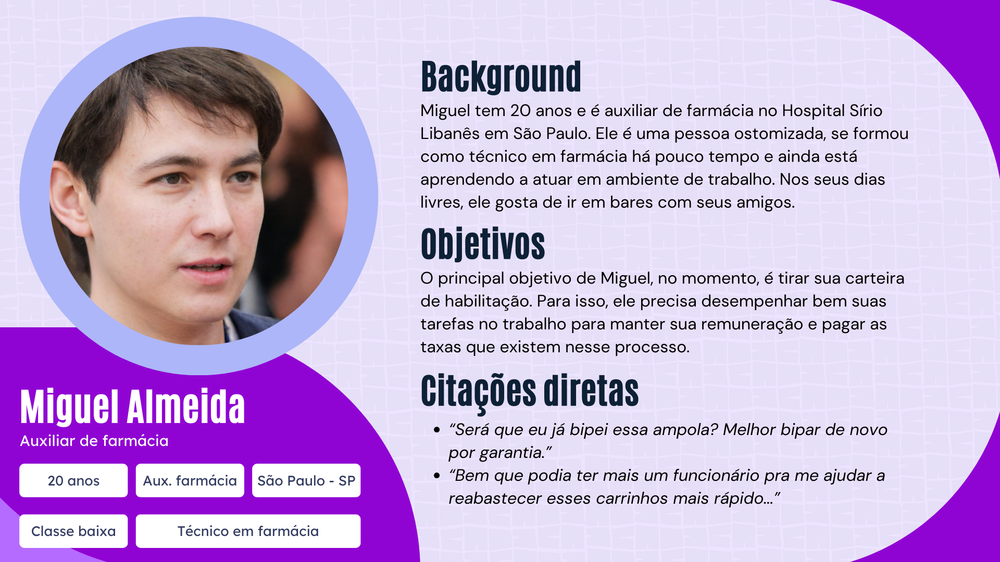
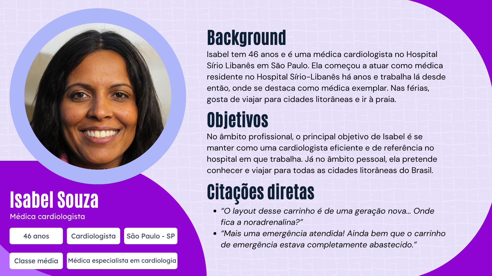

# Definição de personas

##### Personas elaboradas no processo de UX research do projeto

&nbsp;&nbsp;&nbsp;&nbsp;"Persona" é o nome dado a uma pessoa fictícia criada para guiar o desenvolvimento de um produto e/ou serviço de acordo com um determinado perfil que se dá pelo(s) usuário(s) deste. As personas se diferem da simples definição de um perfil de usuário através da individualização, uma vez que elas apresentam nome, idade, hobbies etc. individuais e não apenas características gerais de um grupo de pessoas ao qual o produto se dirige.

&nbsp;&nbsp;&nbsp;&nbsp;No contexto do presente projeto, a equipe Violeta elaborou duas personas diferentes. A primeira refere-se a um auxiliar de farmácia, que usaria a solução desenvolvida no momento do reabastecimento dos carrinhos de parada. A segunda, refere-se a uma médica, que usufruiria indiretamente da solução ao utilizar os itens repostos nos carrinhos de parada. Num cenário real, ambas as personas dificilmente teriam contato direto entre si no ambiente de trabalho. A ligação entre eles, em prática, é indireta e se dá através do carrinho de parada, que é reabastecido e organizado pelo auxiliar e utilizado em emergências pela médica.

&nbsp;&nbsp;&nbsp;&nbsp;Vale ressaltar que ambas as personas possuem um alto nível de letramento digital, uma vez que trabalham num ambiente hospitalar imerso em tecnologia de ponta, cujo uso é rotineiro para elas. Ademais, cada uma das personas, que estão retratadas nas figuras a seguir, conta (também) com uma tabela que apresenta suas respectivas dores, necessidades e desejos.

Figura 1 - Layout de persona (auxiliar de farmácia)

Fonte: Elaboração própria

Tabela 1 - Tabela de dores, desejos e necessidades de persona (Auxiliar de farmácia)

| **Dores** | **Desejos** | **Necessidades**  |
| --------- | ----------- | ----------------- |
| 1 - Às vezes, por engano, Miguel “bipa” duas vezes ou esquece de “bipar” um mesmo item no reabastecimento dos carrinhos de emergência      2 - Às vezes, sem querer, Miguel deixa um dos itens para reabastecimento cair no chão      3 - Miguel demora um tempo elevado no reabastecimento de carrinhos: cerca de 51 minutos | 1 - Miguel deseja saber quais itens bipou e quais itens não bipou      2 - Miguel deseja reabastecer os carrinhos de emergência num período de tempo menor do que o atual | 1 - Miguel precisa bipar cada item reposto exatamente uma vez      2 - Miguel não pode deixar quaisquer itens caírem no chão |

Fonte: Elaboração própria

&nbsp;&nbsp;&nbsp;&nbsp;Diante do exposto, percebe-se que Miguel tem dificuldade na bipagem dos itens de reabastecimento dos carrinhos de emergência e em realizar a própria tarefa de reabastecimento em uma quantidade menor de tempo. Com isso, é evidente que a solução de automação proposta pelo grupo Violeta pode ajudá-lo no sentido de possibilitar o rastreamento dos itens bipados por meio de uma interface visível e, além disso, no sentido de aumentar a rapidez e precisão do reabastecimento dos carrinhos, uma vez que será realizado por um robô, que é menos suscetível a bipar ou realocar itens de forma errônea.

Figura 2 - Layout de persona (médica)

Fonte: Elaboração própria

Tabela 2 - Tabela de dores, desejos e necessidades de persona (Médica)

| **Dores** | **Desejos** | **Necessidades**  |
| --------- | ----------- | ----------------- |
| 1 - Às vezes, em situações de emergência, Isabel tem dificuldade para identificar a localização de itens em carrinhos de parada com layouts de gerações mais recentes      2 - Às vezes, em situações de emergência, Isabel tem seu tempo para prestar socorro reduzido devido à falta ou má localização de itens nos carrinhos de parada | 1 - Isabel deseja reduzir o tempo que ela atualmente leva para atender emergências de parada cardiorrespiratória | 1 - Isabel precisa ter, à sua disposição, todos os equipamentos e medicamentos necessários para atender situações de emergência      2 - Isabel não pode ter parte de seu tempo destinado a atender situações emergências tomado pela necessidade de identificar, dentro de um carrinho de emergência, a localização de cada item |

Fonte: Elaboração própria

&nbsp;&nbsp;&nbsp;&nbsp;À vista da figura e da tabela referentes à Isabel, percebe-se que o reabastecimento correto dos carrinhos de emergência é de suma importância para que o desempenho pleno das atividades dos médicos do Hospital Sírio Libanês ocorra durante situações de emergência — o abastecimento de um item a menos ou em um lugar errado dentro do layout estabelecido no carrinho pode resultar, até mesmo, na morte de uma pessoa. Por isso, a solução proposta pelo grupo Violeta, novamente, tem sua importância reafirmada: a automação do processo de reabastecimento dos carrinhos de emergência tende a diminuir a ocasião de erros na montagem de layouts e na quantificação de itens dentro de cada carrinho.
