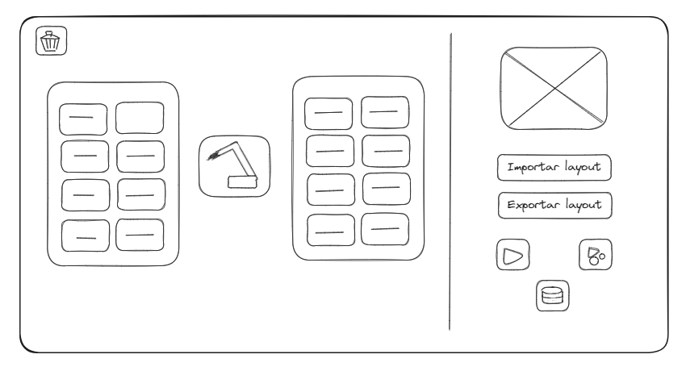
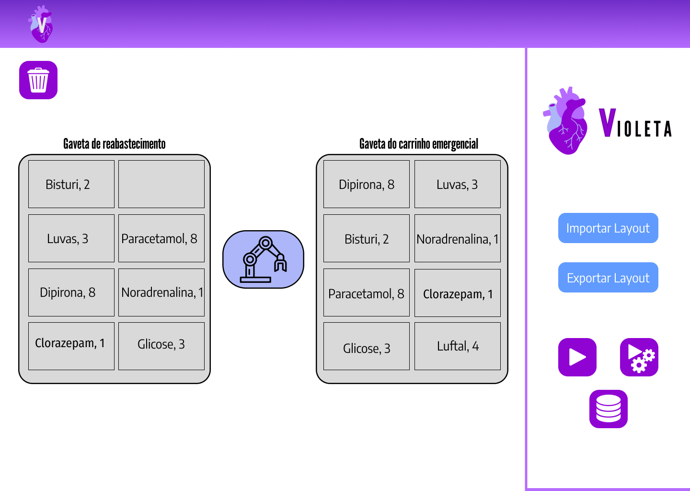
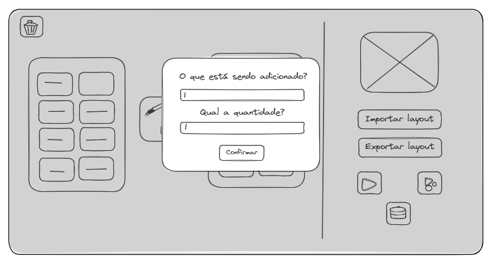
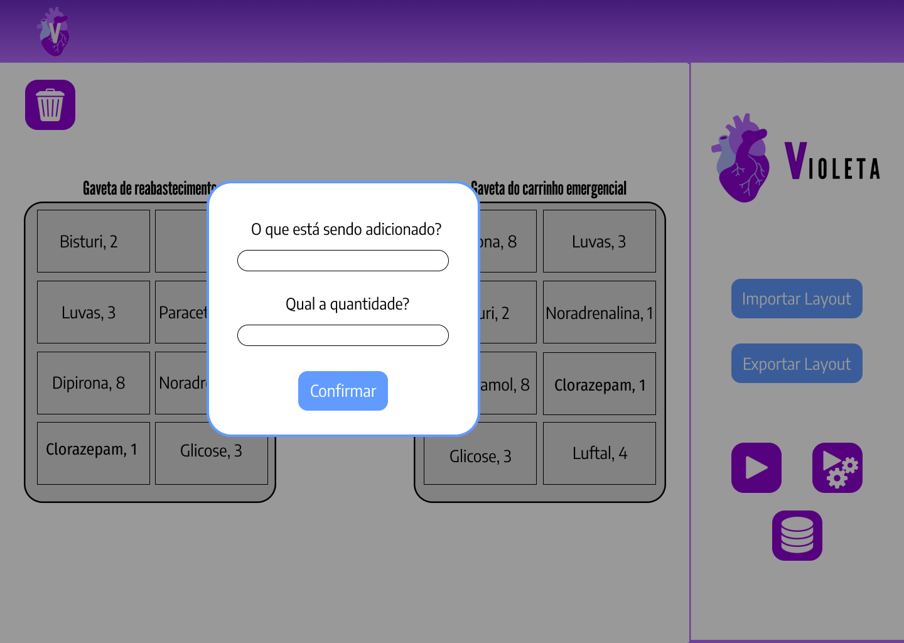
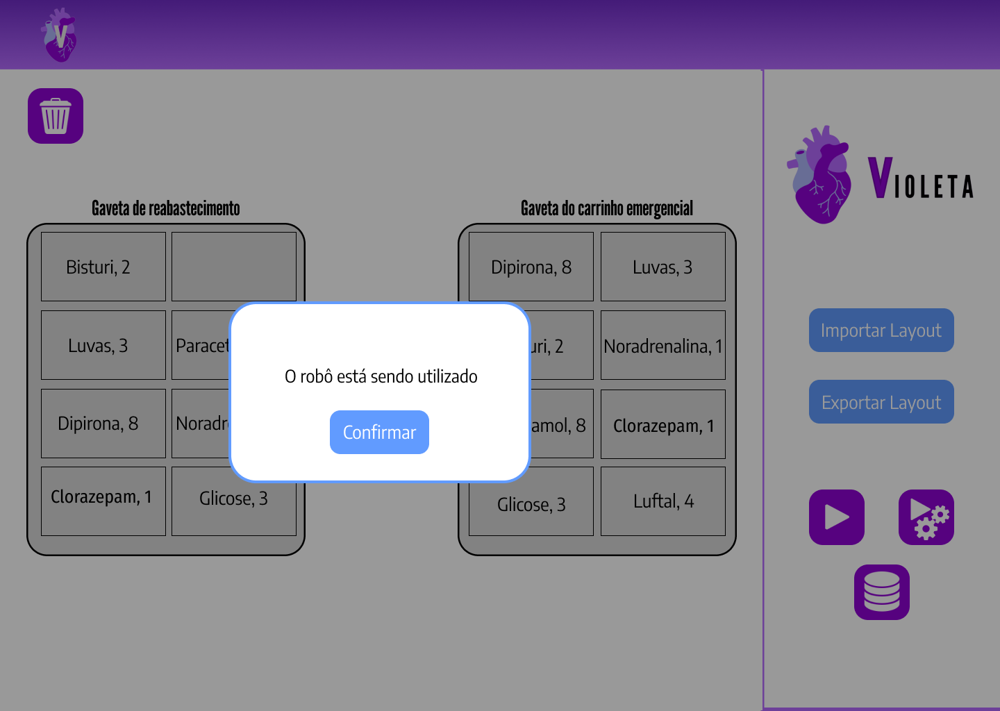
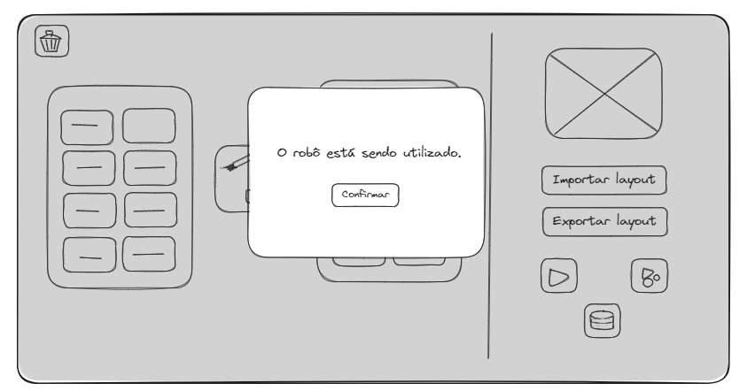
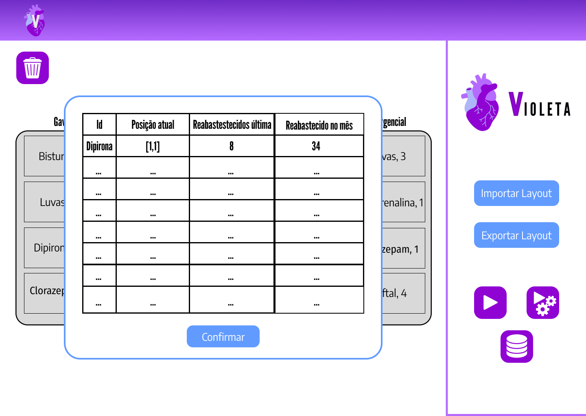
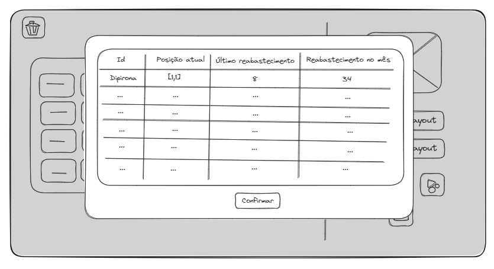

# Mapeamento do fluxo

## Mapeamento do fluxo - Médica Isabel

&nbsp;&nbsp;&nbsp;&nbsp;A user story de máxima prioridade para a nossa persona Isabel, uma médica, destaca-se como uma demanda crucial: "Como médica cardiologista, quero que o sistema permita a personalização do conteúdo do carrinho de emergência de acordo com as necessidades específicas de cada médico e/ou situação, para que eu possa ter os recursos mais adequados à mão."

&nbsp;&nbsp;&nbsp;&nbsp;Em um cenário onde a eficiência e a personalização são elementos críticos, especialmente para os carrinhos de emergência, que abrigam uma variedade de itens cuja disposição deve ser de conhecimento preciso do médico, nosso sistema responde a essa demanda com uma ferramenta. Essa ferramenta não apenas permite a personalização do conteúdo dos carrinhos, mas também possibilita a criação, edição e salvamento de layouts específicos, incluindo a organização das gavetas de forma intuitiva e adaptável.

&nbsp;&nbsp;&nbsp;&nbsp;É crucial enfatizar que, nesse contexto, a presença física do robô não é necessária para a execução dessa ação por parte do usuário. A manipulação física do carrinho é considerada uma atividade alheia à responsabilidade da persona Isabel, uma vez que a execução da tarefa é totalmente dependente do software, proporcionando praticidade e agilidade no acesso aos recursos essenciais.

### Mapeamento de Exportar Layout

&nbsp;&nbsp;&nbsp;&nbsp;O procedimento de exportação de layout emerge como uma funcionalidade de suma importância para a personalização do carrinho de emergência. Quando o usuário opta por um espaço vazio na montagem do layout, tem a capacidade de inserir não apenas o nome do item, mas também a quantidade que ocupará o espaço designado. Ao acionar a opção "exportar layout", as posições são registradas em matrizes, onde cada gaveta do layout é correlacionada a uma matriz específica. Estas informações são arquivadas em um documento CSV, o qual apresenta colunas distintas para o Nome do item, Quantidade do item, Número da gaveta, e Local na matriz (coordenadas x, y). Este processo assegura não apenas a organização eficiente, mas também a identificação ágil dos recursos contidos no carrinho de emergência.

Figura 1 - Mapeamento de Exportar Layout

Fonte: Elaboração própria

### Mapeamento de Importar Layout

&nbsp;&nbsp;&nbsp;&nbsp;A funcionalidade de importar layout complementa o processo, permitindo que o usuário recupere layouts previamente personalizados. Ao selecionar a opção "importar layout" e escolher o arquivo CSV desejado, o sistema exibe uma representação visual do layout na tela do usuário. O exemplo de disposição do CSV inclui as informações cruciais, como nome do item, quantidade, número da gaveta e coordenadas na matriz. Essa abordagem simplificada torna o processo de importação intuitivo, proporcionando uma maneira eficiente de recuperar configurações personalizadas.

Figura 2 - Mapeamento de Importar Layout

Fonte: Elaboração própria

=======
### Mapeamento do fluxo do projeto

&emsp;&emsp;O mapeamento do fluxo é uma ferramenta incrivelmente valiosa para qualquer projeto. Ao realizar o mapeamento do fluxo, não apenas podemos identificar recursos desperdiçados, mas também avaliar minuciosamente o fluxo de trabalho em todas as suas etapas. Isso inclui a identificação de atividades redundantes, atrasos desnecessários e quaisquer outras áreas que possam prejudicar a eficiência ou a qualidade do projeto.

&emsp;&emsp;Além disso, o mapeamento do fluxo oferece uma visão abrangente de como as diferentes partes do projeto se conectam e interagem entre si. Isso ajuda a entender melhor a dinâmica do mesmo e a identificar oportunidades de otimização do processo. Ao visualizar o fluxo de trabalho de forma clara e detalhada, é possível tomar melhores em relação ao planejamento, execução e controle do projeto.

&emsp;&emsp;Outro benefício do mapeamento do fluxo é a melhoria da comunicação e colaboração entre os membros da equipe no projeto. Ao ter uma representação visual do fluxo de trabalho, todos os presentes podem ter uma compreensão melhor das atividades e responsabilidades, facilitando a coordenação e os esforços.

&emsp;&emsp;Adicionalmente, o mapeamento do fluxo não se limita apenas à identificação de problemas; também serve como base para a adição de melhorias contínuas. Ao destacar áreas de desperdício e ineficiência, podemos desenvolver e implementar estratégias para eliminar ou reduzir esses problemas, promovendo assim uma cultura de melhoria contínua ao longo do ciclo de vida do projeto.

&emsp;&emsp;Em resumo, o mapeamento do fluxo é uma ferramenta poderosa que oferece uma compreensão aprofundada do fluxo de trabalho de um projeto, permitindo a identificação de desperdícios, a otimização do processo, a melhoria da comunicação e colaboração, e a promoção da melhoria contínua. Integrar essa abordagem ao seu projeto pode resultar em uma execução mais eficiente, eficaz e bem-sucedida.

&emsp;&emsp;Segue abaixo o mapeamento de fluxo do projeto [Violeta](https://inteli-college.github.io/2024-T0008-EC05-G03/) referente tanto as User Stories quanto Jornadas de Usuários das personas.

---

---

### Wireframe da aplicação web referente ao projeto

&emsp;&emsp;Para complementar a solução, foi desenvolvido um wireframe para a aplicação web responsável por controlar o robô. Um wireframe é uma representação visual básica e esquemática da interface de um software ou site, que mostra a estrutura e disposição dos elementos sem se aprofundar em detalhes visuais ou de design. Ele serve como um guia inicial para o layout e a funcionalidade da interface, permitindo uma compreensão clara da arquitetura da aplicação antes do desenvolvimento completo.

&emsp;&emsp;Além disso, o processo de criação de wireframes ajuda a identificar e resolver problemas de usabilidade e fluxo de interação antes que se tornem mais complexos e difíceis de corrigir durante as etapas posteriores de desenvolvimento. Ao fornecer uma estrutura clara e organizada para a interface, o wireframe ajuda a garantir que a aplicação web seja intuitiva e fácil de usar para os usuários finais.

&emsp;&emsp;Portanto, ao criar um wireframe para a aplicação web de controle do robô, estamos estabelecendo uma base sólida para o desenvolvimento subsequente, garantindo que o produto final atenda às necessidades dos usuários e alcance os objetivos do projeto de forma eficiente e eficaz.

&emsp;&emsp;Abaixo segue as imagens relacionadas ao wireframe:

Figura 1 - Tela de inicio baixa fidelidade

Fonte: Elaboração própria

Figura 2 - Tela de inicio alta fidelidade

Fonte: Elaboração própria

Figura 3 - Botões tela de inicio

Fonte: Elaboração própria

&emsp;&emsp;O design da tela inicial foi meticulosamente concebido para incorporar a máxima simplicidade, aderindo à eficiente regra dos três cliques. Esta abordagem visa garantir que todas as ações sejam realizadas com no máximo três cliques, proporcionando uma experiência intuitiva e eficaz aos usuários. Na interface inicial, destacam-se as seguintes funcionalidades: a capacidade de criar um layout personalizado (Botão 1), exportar (Botão 4) e importar(Botão 5) layouts, iniciar o sistema de montagem (Botão 2) e visualizar o histórico completo das montagens realizadas (Botão 3). Essa abordagem simplificada não apenas otimiza a usabilidade, mas também amplia a acessibilidade, permitindo que os usuários realizem suas tarefas de forma eficiente e direta, sem complicações desnecessárias.

#### Botão 1 - Adicionar item no layout

Figura 4 - Tela de adicionar item baixa fidelidade

Fonte: Elaboração própria

Figura 5 - Tela de adicionar item alta fidelidade

Fonte: Elaboração própria

&emsp;&emsp;Ao criar o layout, o usuário tem a opção de selecionar os espaços em branco desejados. Posteriormente, é exibida uma janela pop-up que facilita a inclusão do nome do item desejado, assim como a definição da quantidade que será alocada para o espaço selecionado. Este processo simplificado e intuitivo oferece ao usuário um controle preciso sobre a disposição dos itens no layout, ao mesmo tempo em que proporciona uma experiência fluida e eficiente na atribuição de nomes e quantidades a cada espaço específico.

#### Botão 2 - Iniciar o sistema

Figura 6 - Pop up de feedback de uso do robô - baixa fidelidade

Fonte: Elaboração própria

Figura 7 - Pop up de feedback de uso do robô - alta fidelidade

Fonte: Elaboração própria

&emsp;&emsp;Ao iniciar o sistema, uma notificação pop-up é automaticamente exibida, fornecendo feedback imediato de que o robô está atualmente em uso. Essa funcionalidade informativa visa manter o usuário ciente do estado operacional do sistema, assegurando uma interação transparente e uma compreensão imediata do status do robô assim que o processo é iniciado.

#### Botão 3 - Histórico de montagem

Figura 8 - Tabela de histórico de montagem - baixa fidelidade

Fonte: Elaboração própria

Figura 9 - Tabela de histórico de montagem - alta fidelidade

Fonte: Elaboração própria

&emsp;&emsp;A tela exibe um abrangente histórico de montagem, apresentando de maneira detalhada todos os itens incluídos, acompanhados de suas respectivas quantidades. Essa visualização proporciona uma visão completa e organizada do processo de montagem, permitindo ao usuário acessar facilmente informações específicas sobre os itens utilizados e suas quantidades correspondentes ao longo do histórico.
