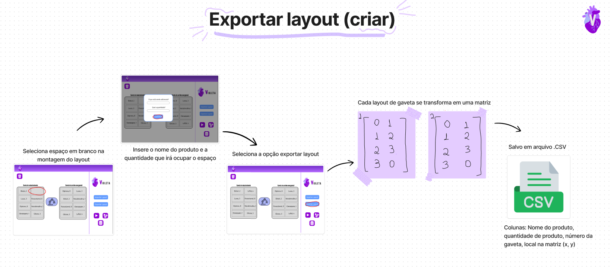
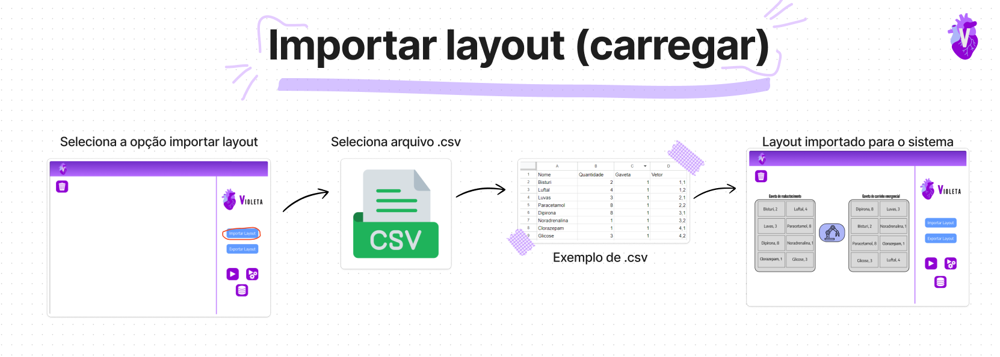

# Mapeamento do fluxo

### Mapeamento do fluxo - Médica Isabel

&nbsp;&nbsp;&nbsp;&nbsp;A user story de máxima prioridade para a nossa persona Isabel, uma médica, destaca-se como uma demanda crucial: "Como médica cardiologista, quero que o sistema permita a personalização do conteúdo do carrinho de emergência de acordo com as necessidades específicas de cada médico e/ou situação, para que eu possa ter os recursos mais adequados à mão."

&nbsp;&nbsp;&nbsp;&nbsp;Em um cenário onde a eficiência e a personalização são elementos críticos, especialmente para os carrinhos de emergência, que abrigam uma variedade de itens cuja disposição deve ser de conhecimento preciso do médico, nosso sistema responde a essa demanda com uma ferramenta. Essa ferramenta não apenas permite a personalização do conteúdo dos carrinhos, mas também possibilita a criação, edição e salvamento de layouts específicos, incluindo a organização das gavetas de forma intuitiva e adaptável.

&nbsp;&nbsp;&nbsp;&nbsp;É crucial enfatizar que, nesse contexto, a presença física do robô não é necessária para a execução dessa ação por parte do usuário. A manipulação física do carrinho é considerada uma atividade alheia à responsabilidade da persona Isabel, uma vez que a execução da tarefa é totalmente dependente do software, proporcionando praticidade e agilidade no acesso aos recursos essenciais.

##### Mapeamento de Exportar Layout

&nbsp;&nbsp;&nbsp;&nbsp;O procedimento de exportação de layout emerge como uma funcionalidade de suma importância para a personalização do carrinho de emergência. Quando o usuário opta por um espaço vazio na montagem do layout, tem a capacidade de inserir não apenas o nome do item, mas também a quantidade que ocupará o espaço designado. Ao acionar a opção "exportar layout", as posições são registradas em matrizes, onde cada gaveta do layout é correlacionada a uma matriz específica. Estas informações são arquivadas em um documento CSV, o qual apresenta colunas distintas para o Nome do item, Quantidade do item, Número da gaveta, e Local na matriz (coordenadas x, y). Este processo assegura não apenas a organização eficiente, mas também a identificação ágil dos recursos contidos no carrinho de emergência. 

Figura 1 - Mapeamento de Exportar Layout

Fonte: Elaboração própria

##### Mapeamento de Importar Layout

&nbsp;&nbsp;&nbsp;&nbsp;A funcionalidade de importar layout complementa o processo, permitindo que o usuário recupere layouts previamente personalizados. Ao selecionar a opção "importar layout" e escolher o arquivo CSV desejado, o sistema exibe uma representação visual do layout na tela do usuário. O exemplo de disposição do CSV inclui as informações cruciais, como nome do item, quantidade, número da gaveta e coordenadas na matriz. Essa abordagem simplificada torna o processo de importação intuitivo, proporcionando uma maneira eficiente de recuperar configurações personalizadas.

Figura 2 - Mapeamento de Importar Layout

Fonte: Elaboração própria
