# Mapeamento do Fluxo de Utilização da Solução

### Contextualização

&emsp;&emsp;No contexto do desenvolvimento de um produto, o mapeamento de fluxo de utilização se trata de uma ferramenta para UX Design utilizada para auxiliar no detalhamento e compreensão da série de etapas pelas quais um determinado usuário deve passar no processo de utilização do produto. Ao realizar o mapeamento do fluxo, pode-se não apenas identificar recursos desperdiçados, mas também avaliar minuciosamente o fluxo de trabalho em todas as suas etapas. Isso inclui a identificação de atividades redundantes, atrasos desnecessários e quaisquer outras áreas que possam prejudicar a eficiência ou a qualidade do projeto.

&emsp;&emsp;Além disso, o mapeamento do fluxo oferece uma visão abrangente de como as diferentes partes do projeto se conectam e interagem entre si. Isso ajuda a entender melhor a dinâmica do mesmo e a identificar oportunidades de otimização do processo. Ao visualizar o fluxo de trabalho de forma clara e detalhada, é possível tomar melhores em relação ao planejamento, execução e controle do projeto.

&emsp;&emsp;Outro benefício do mapeamento do fluxo é a melhoria da comunicação e colaboração entre os membros da equipe no projeto. Ao ter uma representação visual do fluxo de trabalho, todos os presentes podem ter uma compreensão melhor das atividades e responsabilidades, facilitando a coordenação e os esforços.

&emsp;&emsp;Adicionalmente, o mapeamento do fluxo não se limita apenas à identificação de problemas; também serve como base para a adição de melhorias contínuas. Ao destacar áreas de desperdício e ineficiência, podemos desenvolver e implementar estratégias para eliminar ou reduzir esses problemas, promovendo assim uma cultura de melhoria contínua ao longo do ciclo de vida do projeto.

&emsp;&emsp;À vista dos benefícios que o mapeamento de fluxo traz para o desenvolvimento de um produto, a equipe Violeta optou por usá-lo no contexto deste projeto. Para isso, a equipe preferiu estruturar o mapeamento com base em “wireflows”, que consistem da mistura de wireframes e fluxogramas e permitem o desenvolvimento da solução de modo centrado numa boa experiência de usuário.

### Mapeamento do fluxo - Auxiliar de farmácia Miguel

&emsp;&emsp;Dentre as user stories associadas ao Miguel Almeida, que, sob o contexto do projeto, é a persona referente ao papel de auxiliar de farmácia, destaca-se, como de maior importância, a seguinte: “Como auxiliar de farmácia no Hospital Sírio-Libanês, quero ter a capacidade de monitorar o processo de carregamento dos carrinhos de emergência remotamente, para que eu possa acompanhar o progresso e identificar gargalos ou problemas em tempo real.” 

&emsp;&emsp;Tal importância se dá pela possibilidade, para o auxiliar de farmácia, de acompanhar o reabastecimento dos carrinhos de emergência pelo braço robótico e as informações derivadas desse processo. Esse acompanhamento, por sua vez, será feito por meio da interface de canva interativo proposto na arquitetura da solução da equipe Violeta, cujos dois principais fluxos de utilização atrelados a user story em questão estão mapeados a seguir.

##### Mapeamento de monitoramento remoto do processo de carregamento (antes e durante)

&emsp;&emsp;Como se observa no mapeamento do fluxo da figura 1, o auxiliar de farmácia aperta o botão de iniciar no canto inferior direito da página, o que envia uma requisição para a parte de backend da solução, responsável por se comunicar com o braço mecânico através de um import ou micro serviço, o que dará início ao movimento deste e ao processo de reabastecimento do carrinho de emergência. Com isso, o script do robô se comunicará novamente com o backend da solução, que receberá um aviso de que o processo de reabastecimento iniciou e informará esse fato para o usuário por meio de um pop-up no canva interativo, caso o usuário tente inciá-lo novamente. Assim, o auxiliar de farmácia será capaz de ativar e monitorar — remotamente, através da própria interface — o braço mecânico atuando para reabastecer os carrinhos antes, durante e depois do processo.

Figura 1 - Mapeamento de fluxo de monitoramento antes de e durante o reabastecimento

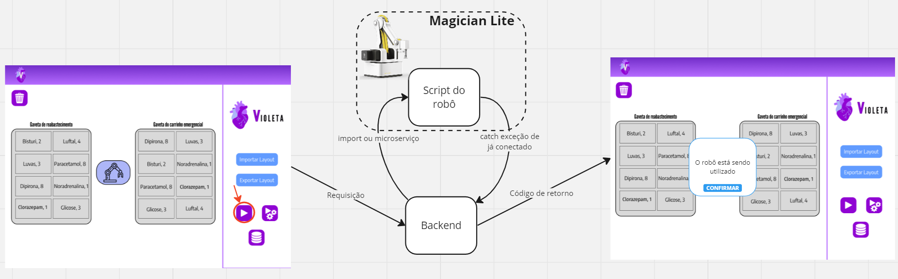

Fonte: Elaboração própria

##### Mapeamento de monitoramento remoto do processo de carregamento (após)

&emsp;&emsp;Já no mapeamento de fluxo da figura 2, verifica-se como o monitoramento do reabastecimento ocorre após a atuação do braço robótico. No canva interativo, ao clicar no botão com um ícone de base de dados, o auxiliar de farmácia faz com que a requisição seja enviada para o backend da solução que, por sua vez, faz uma requisição SQL e/ou Python para acessar uma tabela que mostra a quantidade de recursos de carrinho de parada por posição no layout do carrinho, por quantidade reabastecida no último reabastecimento e por quantidade reabastecida no último mês. Logo após, o backend recebe os dados contidos nessa tabela e, através de um código de retorno, os exibe no canva interativo. Desse modo, além de monitorar a ocorrência do reabastecimento, o auxiliar de farmácia poderá identificar gargalos e problemas nesse processo por meio da análise das quantidades de recursos registradas na tabela do banco de dados.

Figura 2 - Mapeamento de fluxo de monitoramento após o reabastecimento

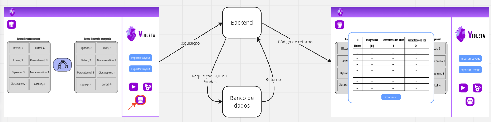

Fonte: Elaboração própria

---

### Mapeamento do fluxo - Médica Isabel

&emsp;&emsp;A user story de máxima prioridade para a nossa persona Isabel, uma médica, destaca-se como uma demanda crucial: "Como médica cardiologista, quero que o sistema permita a personalização do conteúdo do carrinho de emergência de acordo com as necessidades específicas de cada médico e/ou situação, para que eu possa ter os recursos mais adequados à mão."

&emsp;&emsp;Em um cenário onde a eficiência e a personalização são elementos críticos, especialmente para os carrinhos de emergência, que abrigam uma variedade de itens cuja disposição deve ser de conhecimento preciso do médico, nosso sistema responde a essa demanda com uma ferramenta. Essa ferramenta não apenas permite a personalização do conteúdo dos carrinhos, mas também possibilita a criação, edição e salvamento de layouts específicos, incluindo a organização das gavetas de forma intuitiva e adaptável.

&emsp;&emsp;É crucial enfatizar que, nesse contexto, a presença física do robô não é necessária para a execução dessa ação por parte do usuário. A manipulação física do carrinho é considerada uma atividade alheia à responsabilidade da persona Isabel, uma vez que a execução da tarefa é totalmente dependente do software, proporcionando praticidade e agilidade no acesso aos recursos essenciais.

##### Mapeamento de Exportar Layout

&emsp;&emsp;O procedimento de exportação de layout emerge como uma funcionalidade de extrema importância para a personalização do carrinho de emergência. Quando o usuário opta por um espaço vazio na montagem do layout, tem a capacidade de inserir não apenas o nome do item, mas também a quantidade que ocupará o espaço designado. Ao acionar a opção "exportar layout", as posições são registradas em matrizes, onde cada gaveta do layout é correlacionada a uma matriz específica. Estas informações são arquivadas em um documento CSV, o qual apresenta colunas distintas para o Nome do item, Quantidade do item, Número da gaveta, e Local na matriz (coordenadas x, y). Este processo assegura não apenas a organização eficiente, mas também a identificação ágil dos recursos contidos no carrinho de emergência. 

Figura 2 - Mapeamento de Exportar Layout

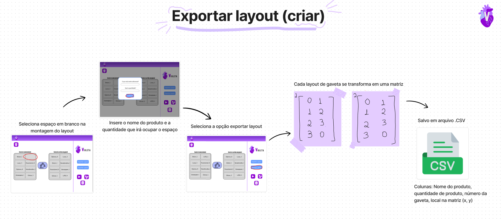

Fonte: Elaboração própria

##### Mapeamento de Importar Layout

&emsp;&emsp;A funcionalidade de importar layout complementa o processo, permitindo que o usuário recupere layouts previamente personalizados. Ao selecionar a opção "importar layout" e escolher o arquivo CSV desejado, o sistema exibe uma representação visual do layout na tela do usuário. O exemplo de disposição do CSV inclui as informações cruciais, como nome do item, quantidade, número da gaveta e coordenadas na matriz. Essa abordagem simplificada torna o processo de importação intuitivo, proporcionando uma maneira eficiente de recuperar configurações personalizadas.

Figura 3 - Mapeamento de Importar Layout

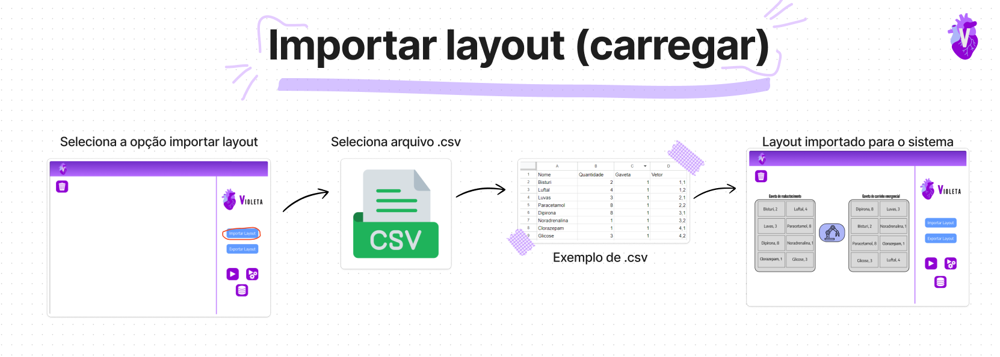

Fonte: Elaboração própria

---

### Wireframe da aplicação web referente ao projeto

&emsp;&emsp;Para complementar a solução, foi desenvolvido um wireframe (disponível [aqui](https://www.figma.com/file/8C2SH6b7EoXIrQ39RWpMlk/Violeta?type=design&node-id=0-1&mode=design&t=ZtciPWIDVm20Qyll-0)) para a aplicação web responsável por controlar o robô. Um wireframe é uma representação visual básica e esquemática da interface de um software ou site, que mostra a estrutura e disposição dos elementos sem se aprofundar em detalhes visuais ou de design. Ele serve como um guia inicial para o layout e a funcionalidade da interface, permitindo uma compreensão clara da arquitetura da aplicação antes do desenvolvimento completo.

&emsp;&emsp;Além disso, o processo de criação de wireframes ajuda a identificar e resolver problemas de usabilidade e fluxo de interação antes que se tornem mais complexos e difíceis de corrigir durante as etapas posteriores de desenvolvimento. Ao fornecer uma estrutura clara e organizada para a interface, o wireframe ajuda a garantir que a aplicação web seja intuitiva e fácil de usar para os usuários finais.

&emsp;&emsp;Portanto, ao criar um wireframe para a aplicação web de controle do robô, estamos estabelecendo uma base sólida para o desenvolvimento subsequente, garantindo que o produto final atenda às necessidades dos usuários e alcance os objetivos do projeto de forma eficiente e eficaz.

&emsp;&emsp;Abaixo, segue as imagens relacionadas ao wireframe da aplicação web da solução desenvolvida pela equipe Violeta:

#### Tela de início

Figura 4 - Tela de inicio (baixa fidelidade)

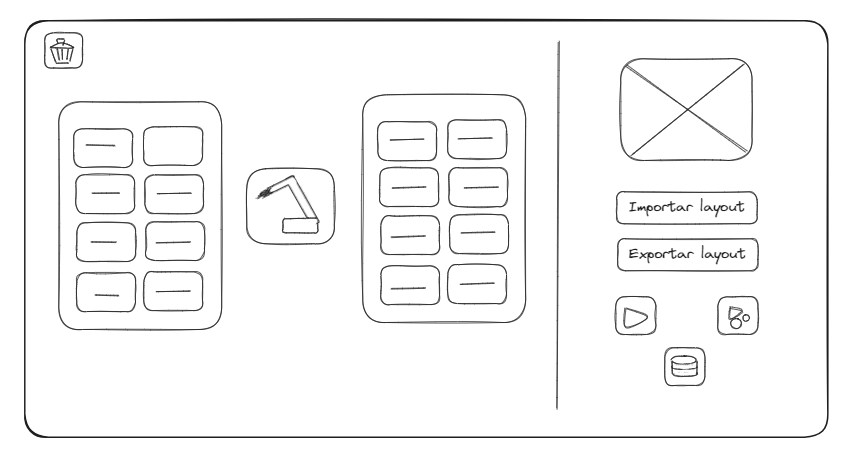

Fonte: Elaboração própria

 

Figura 5 - Tela de inicio (alta fidelidade)

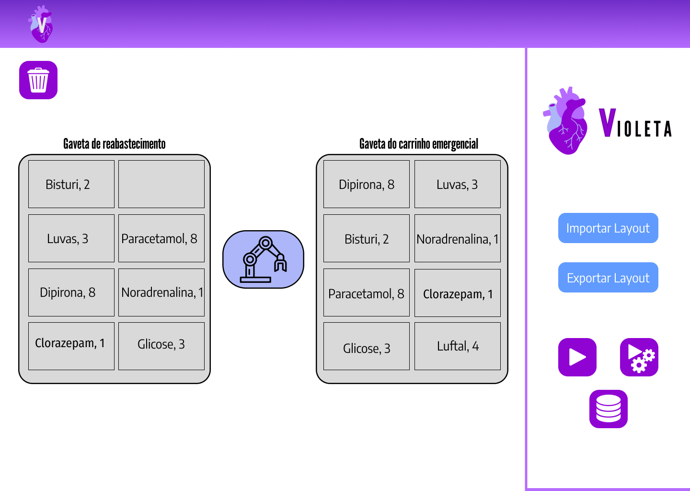

Fonte: Elaboração própria

 

Figura 6 - Botões da tela de inicio

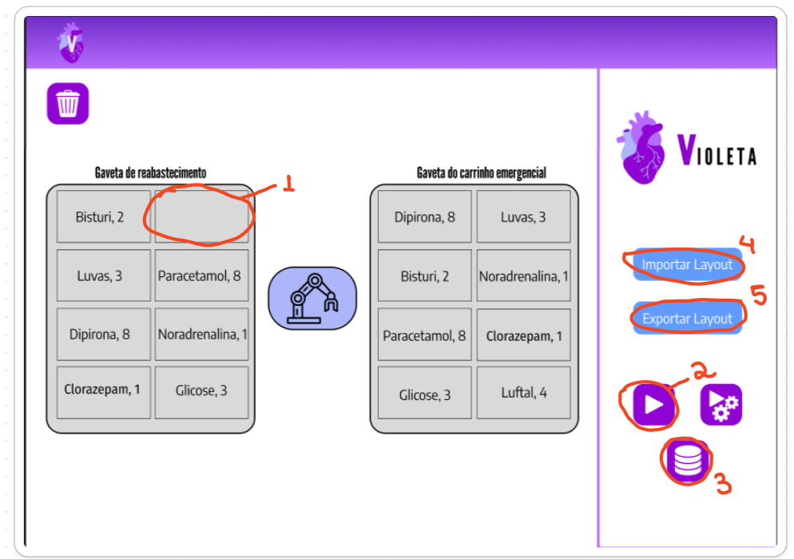

Fonte: Elaboração própria

&emsp;&emsp;O design da tela inicial foi meticulosamente concebido para incorporar a máxima simplicidade, aderindo à eficiente regra dos três cliques. Esta abordagem visa garantir que todas as ações sejam realizadas com no máximo três cliques, proporcionando uma experiência intuitiva e eficaz aos usuários. Na interface inicial, destacam-se as seguintes funcionalidades: a capacidade de criar um layout personalizado (Botão 1), importar (Botão 4) e exportar (Botão 5) layouts, iniciar o sistema de montagem de carrinho (Botão 2) e visualizar o histórico completo das montagens realizadas (Botão 3). Essa abordagem simplificada não apenas otimiza a usabilidade, mas também amplia a acessibilidade, permitindo que os usuários realizem suas tarefas de forma eficiente e direta, sem complicações desnecessárias.

#### Botão 1 - Adicionar item no layout

Figura 7 - Tela de adicionar item (baixa fidelidade)

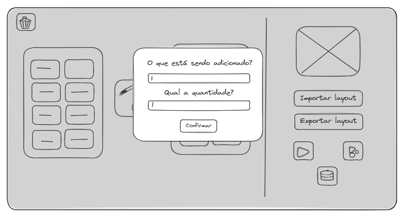

Fonte: Elaboração própria

 

Figura 8 - Tela de adicionar item (alta fidelidade)

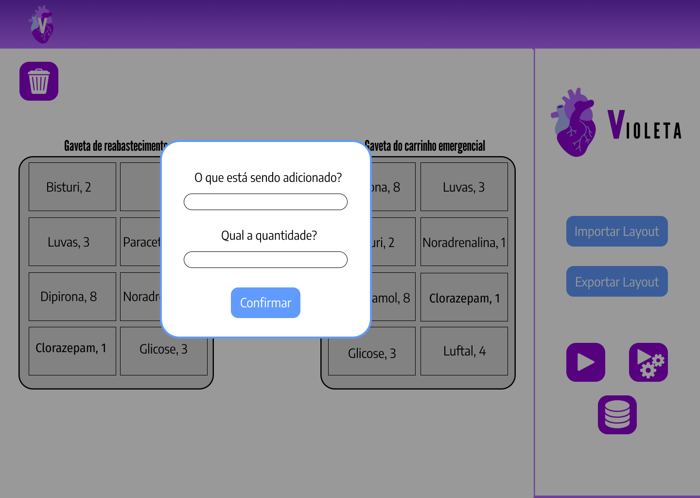

Fonte: Elaboração própria

&emsp;&emsp;Ao criar o layout, o usuário tem a opção de selecionar os espaços em branco desejados. Posteriormente, é exibida uma janela pop-up que facilita a inclusão do nome do item desejado, assim como a definição da quantidade que será alocada para o espaço selecionado. Este processo simplificado e intuitivo oferece ao usuário um controle preciso sobre a disposição dos itens no layout, ao mesmo tempo em que proporciona uma experiência fluida e eficiente na atribuição de nomes e quantidades a cada espaço específico.

#### Botão 2 - Iniciar o sistema de montagem

Figura 9 - Pop up de feedback de uso do robô (baixa fidelidade)

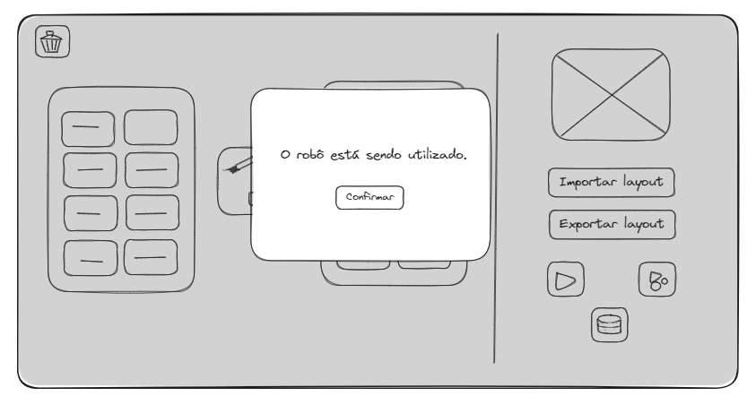

Fonte: Elaboração própria

 

Figura 10 - Pop up de feedback de uso do robô (alta fidelidade)

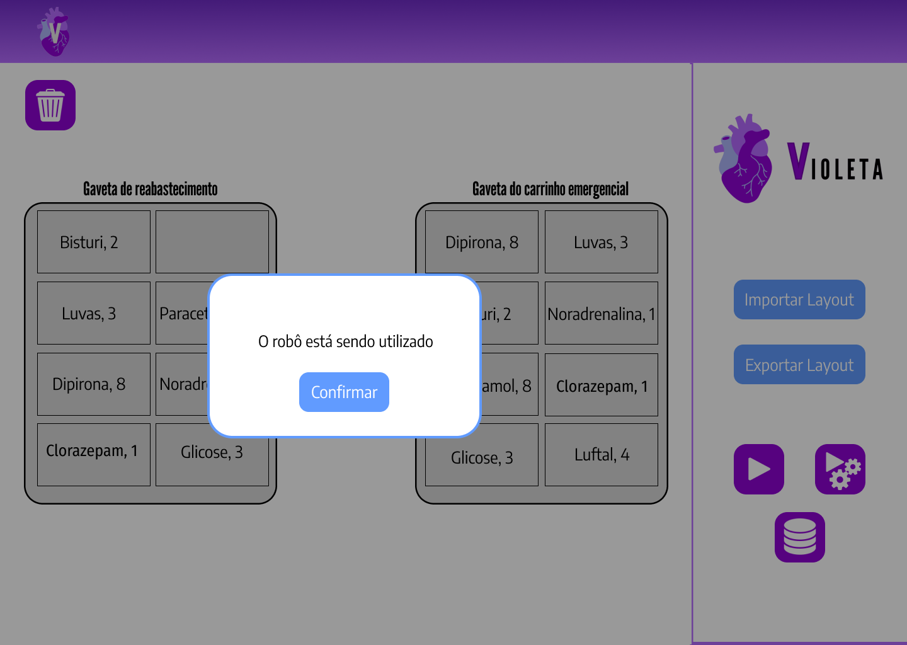

Fonte: Elaboração própria

&emsp;&emsp;Ao iniciar o sistema de montagem, uma notificação pop-up é automaticamente exibida, fornecendo feedback imediato de que o robô está atualmente em uso. Essa funcionalidade informativa visa manter o usuário ciente do estado operacional do sistema, assegurando uma interação transparente e uma compreensão imediata do status do robô assim que o processo é iniciado.

#### Botão 3 - Histórico de montagem

Figura 11 - Tabela de histórico de montagem (baixa fidelidade)

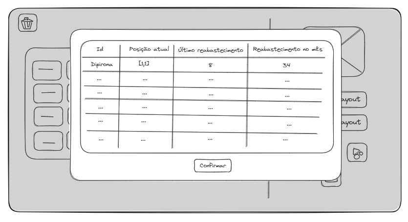

Fonte: Elaboração própria

 

Figura 12 - Tabela de histórico de montagem (alta fidelidade)

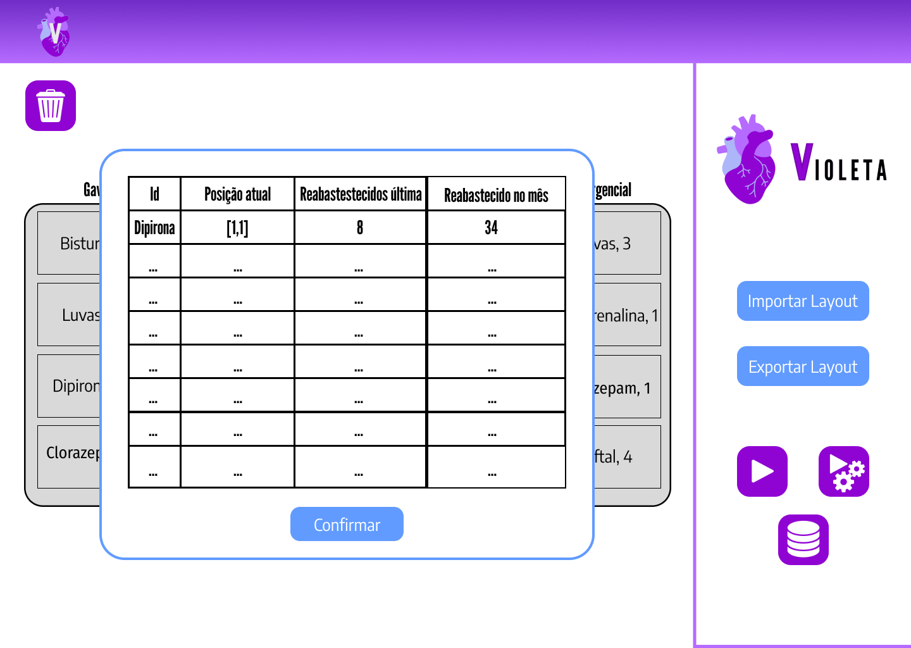

Fonte: Elaboração própria

&emsp;&emsp;A tela exibe um abrangente histórico de montagem, apresentando de maneira detalhada todos os itens incluídos, acompanhados de suas respectivas quantidades. Essa visualização proporciona uma visão completa e organizada do processo de montagem, permitindo ao usuário acessar facilmente informações específicas sobre os itens utilizados e suas quantidades correspondentes ao longo do histórico.
