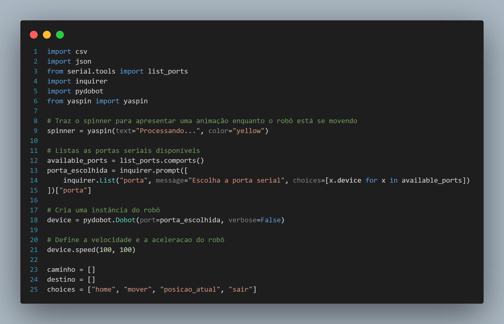

# CLI e relação com a solução

## Contextualização

&emsp;&emsp;Durante a segunda sprint do desenvolvimento do projeto, a equipe Violeta focou na construção de uma CLI (Command Line Interface ou, em português, Interface de Linha de Comando), que se trata de uma interface na qual um usuário pode digitar termos pré-definidos que, quando ordenados e em conjunto, significam comandos para que o computador execute determinadas ações. No contexto do projeto, a CLI foi desenvolvida sobre a linguagem Python 3 e construída a fim de possibilitar que, através de um computador, seja possível executar ações básicas de movimento com o robô Dobot Magician Lite.

&emsp;&emsp;À vista disso, ao decorrer desta seção, serão apresentados trechos de códigos que serão relacionados à proposta de arquitetura desenvolvida na sprint 1 e a casos de uso sob contexto do projeto. Por isso, para melhor entendimento, deve-se ler as seções da documentação referente às [tecnologias utilizadas](https://inteli-college.github.io/2024-T0008-EC05-G03/sprint-2/sistema-robotico/tecnologias) na sprint 2 e à [inicialização local da CLI](https://inteli-college.github.io/2024-T0008-EC05-G03/sprint-2/sistema-robotico/inicializacao).

### Vídeo de demonstração

&emsp;&emsp;De forma complementar à documentação desta seção, para melhor entendimento da CLI e de como essa interface interage no contexto do projeto, a equipe Violeta elaborou dois vídeos de demonstração de interação de usuário com a CLI para controle do robô de braço mecânico. Um dos vídeos é focado na atuação do robô de braço mecânico e está disponível [aqui](https://drive.google.com/file/d/1ynMGicTpoRex3CTolScaMUrtvVt18S8O/view?usp=drive_link), enquanto o outro dá ênfase na CLI para controle do robô e está disponível [aqui](https://drive.google.com/file/d/1wkk0EIFfTO1JKLyZnhKsAN2d60DlYckP/view?usp=sharing). 


> Até o final da sprint 2, o arquivo principal com o código da CLI desenvolvida para a solução se encontra, dentro da estrutura de pastas do repositório do projeto, em: ```./src/ main.py```.

## Relação entre código, arquitetura proposta e casos de uso

&emsp;&emsp;De acordo com o diagrama de blocos na proposta de arquitetura da solução definida na sprint 1, a CLI o código que a compõe podem ser entendidos como parte do bloco de “backend da solução”. Isso significa que a CLI (na etapa atual de desenvolvimento) contém a estrutura lógica necessária para se comunicar com o script do robô e fazê-lo executar determinadas ações, mas não representa a interface visual final com a qual pretende-se que os usuários interajam.

&emsp;&emsp;Diante do exposto, a seguir, estão descritas as relações existentes entre trechos específicos do código no arquivo ```main.py``` e casos de uso.

## 1. Importação de bibliotecas, declaração de variáveis e instanciação de objetos

<p style={{textAlign: 'center'}}>Figura 1 - Importação de bibliotecas, declaração de variáveis e instanciação de objetos</p>



<p style={{textAlign: 'center'}}>Fonte: Elaboração própria</p>

&emsp;&emsp;Neste trecho, são importadas as bibliotecas necessárias para execução da CLI (as quais são detalhadamente descritas na seção de [tecnologias utilizadas](https://inteli-college.github.io/2024-T0008-EC05-G03/sprint-2/sistema-robotico/tecnologias)). A partir da importação dessas bibliotecas, é feita uma série de declaração de variáveis e instanciação de objetos, como na linha 8, na qual, com a biblioteca ```yaspin``` cria-se o objeto responsável por fornecer, para o usuário, o feedback de que um comando está sendo carregado/executado pelo robô.

&emsp;&emsp;Além disso, nesse trecho inicial, por meio da biblioteca ```serial.ports```”, há uma lógica na qual é criada uma lista com todas as portas seriais (USB) em uso pelo computador no momento. A partir dessa lista, com uso da biblioteca “```inquirer```”, a CLI solicita que o usuário selecione qual porta deve ser utilizada para comunicação com o robô. A partir dessa seleção, declara-se o objeto “device”, que representa o próprio robô Dobot Magician Lite.

&emsp;&emsp;Nesse trecho há, ainda, a declaração de variáveis que são listas necessárias para o funcionamento da lógica de demais trechos do código, como ```caminho```, ```destino``` e ```choices```.

## 2. Declaração de funções de comandos básicos

No trecho intermediário do código, são definidas quatro funções:

### ```load_points_from_file(file_path)```

<p style={{textAlign: 'center'}}>Figura 2 - Função "load_points_from_file()"</p>


<p style={{textAlign: 'center'}}>Fonte: Elaboração própria</p>

&emsp;&emsp;Essa função é responsável por carregar, a partir de arquivos do tipo .json ou .csv definidos pelo parâmetro ```file_path```, as posições pré-definidas dos layouts de cada modelo de carrinho de emergência. No contexto geral do MVP da solução, essa função pode ser executada sempre que o auxiliar de farmácia importar um layout através do canva interativo.

### ```ligar_ferramenta()```

<p style={{textAlign: 'center'}}>Figura 3 - Função "ligar_ferramenta()"</p>


<p style={{textAlign: 'center'}}>Fonte: Elaboração própria</p>

&emsp;&emsp;Essa função é responsável por ativar a ferramenta acoplada na extremidade do braço mecânico do robô. No contexto do projeto, essa ferramenta é uma ventosa, o que significa que essa função é executada quando pretende-se que o robô pegue um item de reabastecimento de um carrinho que está abaixo da extremidade do braço mecânico.

### ```desligar_ferramenta()```

<p style={{textAlign: 'center'}}>Figura 4 - Função "desligar_ferramenta()"</p>


<p style={{textAlign: 'center'}}>Fonte: Elaboração própria</p>

&emsp;&emsp;Essa função é responsável por desativar a ferramenta acoplada na extremidade do braço mecânico do robô. No contexto do projeto, essa ferramenta é uma ventosa, o que significa que essa função é executada quando pretende-se que o robô solteum item de reabastecimento de um carrinho que já está sendo segurado pela ventosa.

### ```execute_comando(comando)```

<p style={{textAlign: 'center'}}>Figura 5 - Função "execute_comando()"</p>


<p style={{textAlign: 'center'}}>Fonte: Elaboração própria</p>

&emsp;&emsp;Essa função é responsável por executar um comando que é definido pelo parâmetro ```comando```. Dependendo do valor desse parâmetro, que é passado para a função por meio de uma seleção feita pelo próprio usuário a partir de um menu de múltipla escolha na CLI, o programa realiza ações diferentes.

Caso o usuário opte por:

- ```home```, o robô volta para a posição principal pré-definida pelo arquivo .json ou .csv;
- ```ligar_ferramenta```, a função ```ligar_ferramenta()``` é chamada
- ```desligar_ferramenta```, a função ```desligar_ferramenta()``` é chamada
- ```posicao_atual```, a CLI exibe as coordenadas da posição atual da extremidade do braço mecânico do robô
- ```mover```, a CLI exibe outros dois menus de múltipla escolha: um para escolher a posição do layout da qual o robô deve pegar o remédio (ou outro item do carrinho de emergência) e outro para escolher a posição na qual o robô deve depositar o item pegado; após ambas as seleções, o robô se move, pegando e depositando o(s) itens(s) nas respectivas posições definidas;
- ```sair```, a execução da CLI é interrompida

## 3. Execução da CLI

<p style={{textAlign: 'center'}}>Figura 6 - Trecho de código para execução da CLI</p>


<p style={{textAlign: 'center'}}>Fonte: Elaboração própria</p>

&emsp;&emsp;Ao final do arquivo ```main.py```, encontra-se um bloco de código dentro de uma condição. Essa condição pode ser interpretada como “caso o nome do arquivo atual seja ```__main__```”, o que refere-se ao fato de que, em Python, quando um arquivo de extensão .py é executado, seu nome passa a ser identificado como ```__main__```. Em outras palavras, esse excerto do código é executado toda vez que o arquivo ```main.py``` é executado.

&emsp;&emsp;Portanto, toda vez que o arquivo ```main.py``` é executado, de acordo com as linhas após a condição, a função ```load_points_from_file()``` é executada e as posições de layout pré-definidas são salvas. Depois, o menu de múltipla escolha é exibido continuamente, até que o usuário selecione uma ação para ser executada com o robô ou selecione o comando “sair” para interromper a execução da CLI.
