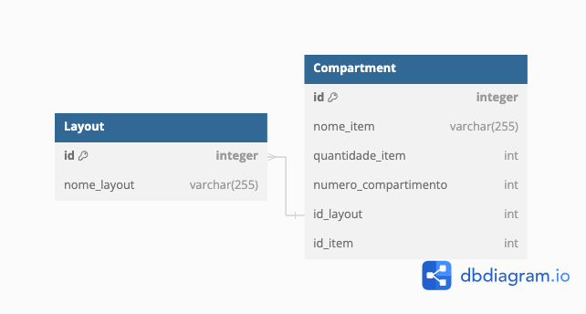

# Base de dados

## Resumo

&emsp;&emsp;Bases de dados, no contexto da computação, são conjuntos de informações de tipos que podem ser variados ou não. Esses mesmos dados podem ser estruturados (quando são organizados por tipos, tabelas, colunas e linhas) ou não-estruturados (quando há mais de um tipo de dado em um arquivo que contém texto, imagens e vídeos, por exemplo).

&emsp;&emsp;Como parte do desenvolvimento da aplicação web da solução proposta pelo grupo Violeta, foi feita uma base de dados para armazenar e gerenciar as informações essenciais para o funcionamento do projeto. Esta base de dados foi projetada para abrigar os dados relacionados aos layouts utilizados no sistema.

## 1. Tabelas

Abaixo seguem todas as tabelas contidas na base de dados e suas respectivas colunas.

### Tabela "Layout"

- **Descrição:** Armazena o nome e o id de um determinado layout.
  
| Coluna          | Tipo       | Descrição                                      |
|-----------------|------------|------------------------------------------------|
| id              | INTEGER    | Chave primária única do layout                 |
| nome_layout     | varchar(255)| Nome do layout                                 |

### Tabela "Compartment"

- **Descrição:** Armazena informações a respeito dos itens armazenados dentro dos compartimentos de cada layout.

| Coluna             | Tipo       | Descrição                                           |
|--------------------|------------|-----------------------------------------------------|
| id                 | INTEGER    | Chave primária única do esquema                     |
| nome_item          | varchar(255)| Nome do item no compartimento                       |
| quantidade_item    | INTEGER    | Quantidade de itens no compartimento                |
| numero_compartimento| INTEGER   | Número do compartimento do layout no qual o item deve ser colocado|
| id_layout          | INTEGER    | Chave estrangeira referenciando o id da tabela "Layout"|
| id_item            | INTEGER    | Chave do remédio a ser adicionado |

## 2. Desenho esquemático da base de dados

&emsp;&emsp; Abaixo, há um desenho esquemático da base de dados desenvolvida, a fim de elucidar a modelagem desta no contexto da sprint 3.

Figura 1 - Desenho esquemático da base de dados

Fonte: Elaboração própria

&emsp;&emsp; Na figura 1, apresentam-se detalhadamente as três tabelas que compõem a base de dados. Cada tabela é acompanhada de seus respectivos atributos, conforme previamente descrito. Essa análise minuciosa oferece uma visão abrangente da estrutura da base de dados, facilitando a compreensão e manipulação dos dados armazenados. Essa documentação é fundamental para garantir a integridade do sistema.
