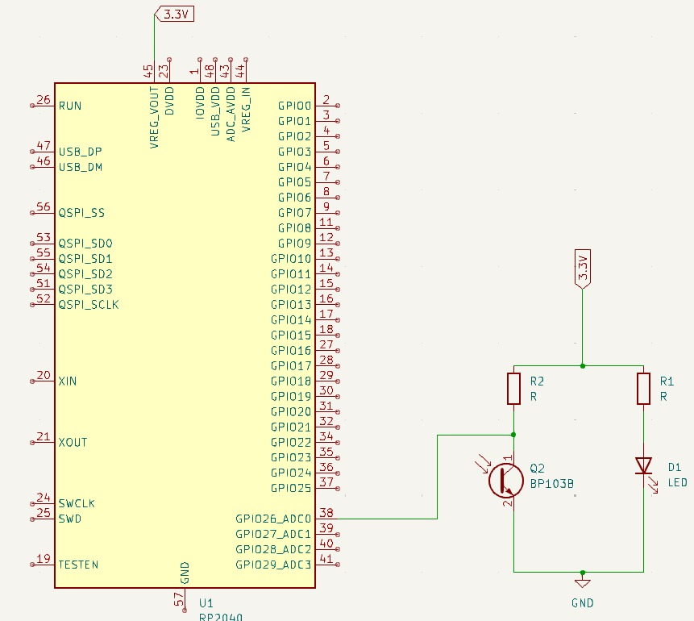

# Periféricos

Documentação dos dispositivos periféricos integrados ao sistema.

## Definições

### Periférico

&emsp;&emsp;Um periférico, no contexto da computação, refere-se a um dispositivo auxiliar e externo ao dispositivo central de um sistema. Geralmente, os periféricos são responsáveis por desempenhar funções que não são estritamente necessárias para o funcionamento geral do sistema, mas que permitem que o sistema seja mais eficiente e/ou acessível, por exemplo.

### Raspberry Pi Pico

&emsp;&emsp;O Raspberry Pi Pico se trata de uma placa de circuito integrado com microcontrolador (dispositivo capaz de controlar componentes eletrônicos por meio de código) conceitualmente conhecida por ser financeiramente e tecnicamente acessível, haja em vista que ele possui um baixo custo de compra e permite a utilização de MicroPython — uma linguagem de alto nível — para programação. Para o desenvolvimento da solução proposta pelo grupo Violeta, foi utilizado o Raspberry Pi Pico com microcontrolador de modelo **RP2040** e com wi-fi integrado.

### Sensor infravermelho

&emsp;&emsp;Sensores infravermelhos são dipositivos eletrônicos responsáveis por detectar ondas infravermelhas (ondas eletromagnéticas cujo comprimento mede entre 700 nanômetros e 1 milímetro). Seu funcionamento consiste na emissão de uma onda infravermelha, a qual é refletida num objeto e retorna para o sensor, que a percebe através de seu detector. No contexto do projeto, optou-se pela utilização do modelo de sensor infravermelho **TCRT5000**.

## Integração no sistema

&emsp;&emsp;Para o desenvolvimento de uma solução segura, o grupo Violeta optou por integrar o Raspberry Pi Pico e o sensor infravermelho dentro de um mesmo circuito acoplado ao robô, a fim de auxiliar na verificação de que um item realmente foi pego pelo braço mecânico. O circuito em questão está representado no desenho esquemático da figura 1, elaborado no software Kicad.

Figura 1 - Desenho esquemático do circuito

Fonte: Elaboração própria

&emsp;&emsp;Como se observa no desenho esquemático, o circuito desenvolvido se baseia no pino 38 (GPIO 26) do Raspberry Pi Pico. Para fins de representação no desenho esquemático, partindo desse pino, há um fio que se conecta com dois componentes (transistor fotovoltaico e LED) que, na verdade, representam um só: o sensor infravermelho. Este é alimentado por um pino de fornecimento de energia com uma voltagem de 3.3V intermediada por resistores.

&emsp;&emsp;Através do pino 38, o microcontrolador recebe os dados de detecção do sensor infravermelho e, sempre que detecta que um objeto foi pego, repassa tal informação para o servidor da aplicação web via HTTP. Dessa forma, existe uma forma de verificação sensorial para confirmar que determinado item do carrinho de parada realmente foi pego. Isso evita que o sistema considere um item como pego apenas pelo fato da ventosa do braço mecânico ter sido ativada em determinado ponto/compartimento de um layout, o que eleva a segurança — parte dos principais requisitos não funcionis almejados pelo cliente — da solução por meio da detecção de erros.
