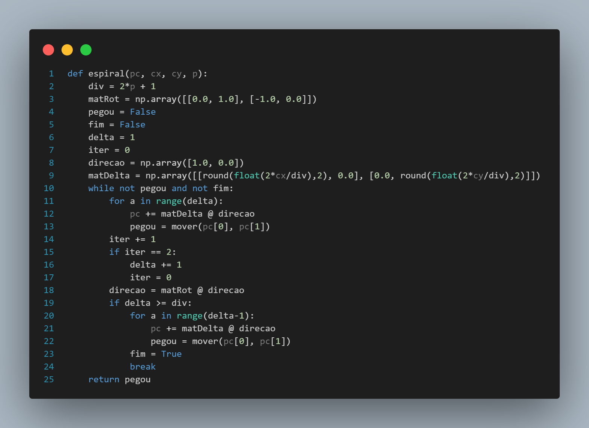
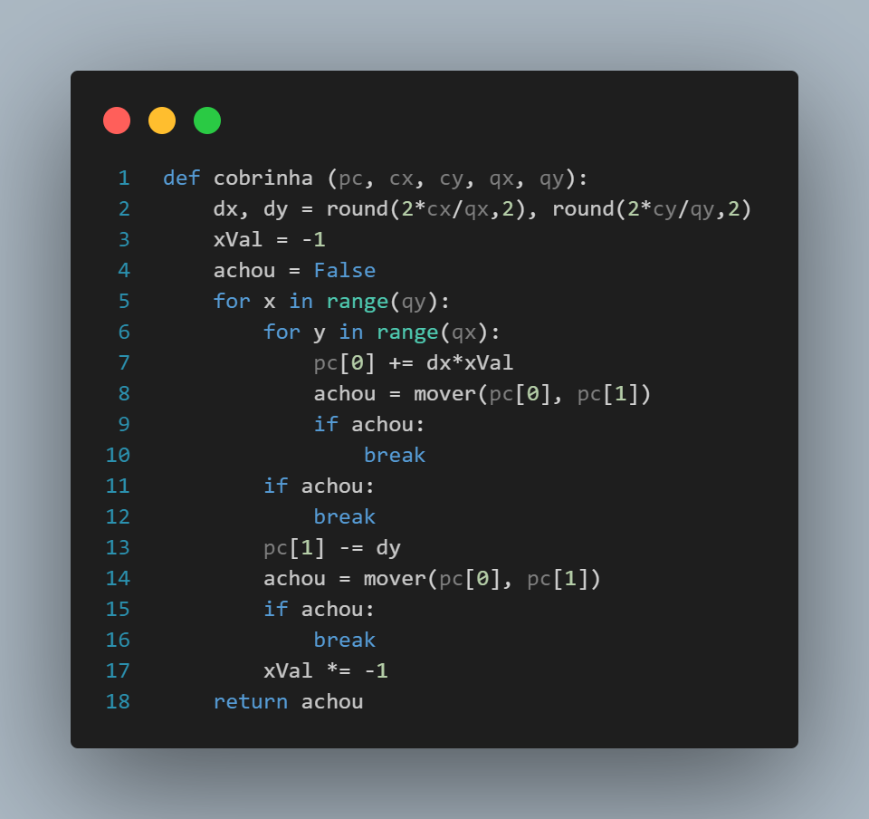

# Rotina de verificação

Documentação da rotina de verificação desenvolvida para o robô de braço mecânico.

## Definição

&emsp;&emsp;A fim de potencializar a segurança oferecida pela solução em desenvolvimento, o grupo Violeta criou uma rotina de verificação para o robô de braço mecânico. A rotina de verificação refere-se a um procedimento de segurança executado pelo braço mecânico toda vez que ele se move para um determinado compartimento de um layout, no qual sua extremidade com ventosa verifica vários espaços dentro do compartimento em vez de um único ponto dentro deste.

&emsp;&emsp;À vista disso, a equipe Violeta desenvolveu dois algoritmos de rotina de verificação, os quais são descritos a seguir.

## Algoritmo 1: Espiral

&emsp;&emsp;O primeiro algoritmo segue, dentro de cada compartimento, um percurso semelhante a uma espiral. Com base num fator multiplicativo definido através das dimensões do compartimento, a extremidade do braço mecânico na qual está acoplada a ventosa:

> 1. para, inicialmente, no centro de um compartimento para pegar determinado item;
> 2. desce e tenta pegar o item em questão;
> 3. no caso de falha, sobe e se move para um ponto a uma determinada distância ao lado do ponto anterior;
> 4. repete o processo a partir do passo 2, aumentando a distância do ponto ao lado de acordo com o fator multiplicativo a cada iteração.

&emsp;&emsp;Com isso, caso o braço mecânico encontre e pegue um item, as informações relacionadas a essa ação são salvas na base de dados da aplicação web da solução. Do contrário, quando nenhum item é encontrado e pego dentro do compartimento, a execução do processo de reabastecimento do carrinho de parada é interrompida.

&emsp;&emsp;Na estrutura de pastas do repositório, esse algoritmo, que é definido pela função representada na figura 1, pode ser encontrado em ```src/main.py```.

<p style={{textAlign: 'center'}}>Figura 1 - Código do algoritmo 1</p>



<p style={{textAlign: 'center'}}>Fonte: Elaboração própria</p>

## Algoritmo 2: Cobrinha

&emsp;&emsp;O segundo algoritmo segue uma lógica semelhante à encontrada nos jogos do tipo "snake game", no qual uma cobra controlada pelo jogador deve comer todas as frutas espalhadas pelo mapa para ganhar. Nesse tipo de jogo, se o jogador controlar a cobra de modo a sempre passar por todos os pontos do mapa, a tendência é que ele ganhe o jogo, uma vez que a cobra sempre comerá pelo menos uma fruta a cada iteração por todo o mapa.

&emsp;&emsp;De maneira análoga, o mesmo ocorre com a ventosa do braço robótico nos compartimentos dos layouts. Caso ela passe por todos os pontos que existem dentro do compatimento seguindo trajetórias lineares e tentando pegar itens do compartimento, ela sempre encontrará e pegará um item (desde que haja um item para ser pego dentro do compartimento).

&emsp;&emsp;Da mesma forma que o algoritmo 1, este algoritmo interrompe o processo de reabastecimento do carrinho de parada quando não encontra e pega nenhum item dentro do compartimento definido. Além disso, ele também foi implementado e também pode ser encontrado em ```src/main.py```. A função que o contém está representada na figura 2.

<p style={{textAlign: 'center'}}>Figura 1 - Código do algoritmo 2</p>



<p style={{textAlign: 'center'}}>Fonte: Elaboração própria</p>
