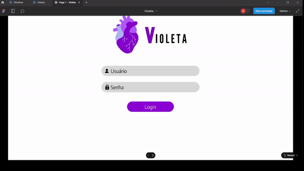

# Mockup

&emsp;&emsp;No processo de desenvolvimento de software, o mockup de uma aplicação desempenha um papel crucial, atuando como uma representação visual e estática do design e layout da interface de usuário. Este elemento gráfico é uma ferramenta valiosa que antecede o estágio de programação, permitindo que desenvolvedores, designers e partes interessadas visualizem e compreendam a estrutura e o fluxo da aplicação antes mesmo de iniciar a codificação.

&emsp;&emsp;Um mockup é uma simulação visual que retrata a aparência e a disposição dos elementos na interface de usuário de uma aplicação. Geralmente estático, ele oferece uma representação gráfica das diferentes telas, componentes e interações que compõem a aplicação. Os mockups podem variar em complexidade, desde esboços simples a designs mais elaborados, proporcionando uma visão clara do produto final.

&emsp;&emsp;Abaixo, tem-se o mockup da solução Violeta:

Figura 1 - Gif de Demonstração do Mockup

Fonte: Elaboração própria

&emsp;&emsp;A demonstração também pode ser visualizada [aqui](https://drive.google.com/drive/folders/14ZJpX0hsesfdj9MjAr5Bf2q9yxehT4uc)
