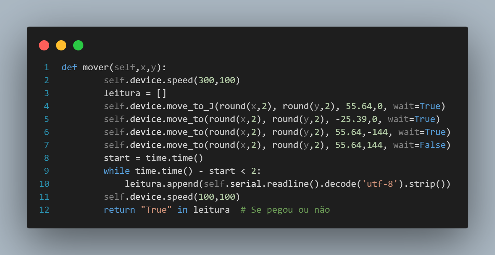

# Integração com o robô

&emsp;&emsp;Para que todas as diferentes partes da solução se comuniquem adequadamente entre si, é necessário que o robô de braço mecânico (Dobot Magician Lite) e o backend da aplicação web da solução estejam interligados. Com base nisso, durante a sprint 4, a equipe Violeta focou em integrar o script do robô com o backend da solução.

## Classe de integração: ```Robo```

&emsp;&emsp;Para integrar o robô com a API desenvolvida como parte do backend, foi necessário criar uma classe representante do robô chamada, a qual foi nomeada ```Robo``` e contém atributos e métodos ligados às suas ações de movimentação. Dentro da estrutura de pastas, o arquivo com essa classe está contido em ```./src/roboClass.py```.

### Atributos

&emsp;&emsp;A classe Robo possui uma série de atributos que são declarados no início de sua estrutura. Tais atributos podem ser observados na figura 1.

<p style={{textAlign: 'center'}}>Figura 1 - Métodos da classe Robo</p>

<!-- <div style={{margin: 25}}>
    <div style={{textAlign: 'center'}}>
        
        <br/>
    </div>
</div> -->

<p style={{textAlign: 'center'}}>Fonte: Elaboração própria</p>

- Os atributos ```mR``` e ```mA``` referem-se às duas matrizes que devem constar no instanciamento de um objeto da classe e que contêm o id, o nome e a quantidade de um determinado item em um determinado compartimento do layout de um carrinho.

- O atributo ```device``` trata-se de uma instância da classe ```Dobot``` contida na biblioteca Pydobot. Essa classe representa a comunicação com o próprio robô e oferece suporte para todas as funções ligadas a movimentação do braço mecânico.

- O atributo ```serial``` representa a porta serial (USB) com a qual é feita a comunicação com o sensor infravermelho acoplado ao robô.


### Método mover

<p style={{textAlign: 'center'}}>Figura 2 - Método mover</p>

<!--  -->

<p style={{textAlign: 'center'}}>Fonte: Elaboração própria</p>

&emsp;&emsp;O método mover recebe os parâmetros ```x``` e ```y```, que representam as respectivas coordenadas necessárias para movimentação do braço mecânico num plano bidimensional. Quando o método é executado, a velocidade de movimentação do braço mecânico é ajustada, a movimentação para a posição determinada pelos parâmetros é feita e, durante 2 segundos, o dado booleano de se algum objeto foi detectado pelo sensor infravermelho é registrada na variável do tipo lista "leitura". Caso essa detecção ocorra, o método retorna ```True```.


### Método espiral e método cobrinha

&emsp;&emsp;Os métodos ```espiral``` e ```cobrinha``` são referentes às rotinas de verificação implementadas pela equipe Violeta. Mais informações sobre elas podem ser encontradas [nesta seção](../../sprint-3/hardware_integracao/rotina_verificacao.md).


### Método reabastecer

<p style={{textAlign: 'center'}}>Figura 3 - Método reabastecer</p>


<p style={{textAlign: 'center'}}>Fonte: Elaboração própria</p>

&emsp;&emsp;O método reabastecer é responsável por executar a ação de reabastecimento do robô de braço mecânico. 


### Método inicial

<p style={{textAlign: 'center'}}>Figura 4 - Método inicial</p>


<p style={{textAlign: 'center'}}>Fonte: Elaboração própria</p>

&emsp;&emsp;A classe Robo possui uma série de atributos que são declarados no início de sua estrutura. Tais atributos podem ser observados na figura 1.


### Método fechar

<p style={{textAlign: 'center'}}>Figura 5 - Método fechar</p>


<p style={{textAlign: 'center'}}>Fonte: Elaboração própria</p>

&emsp;&emsp;A classe Robo possui uma série de atributos que são declarados no início de sua estrutura. Tais atributos podem ser observados na figura 1.


### Método ferramenta

<p style={{textAlign: 'center'}}>Figura 6 - Método ferramenta</p>


<p style={{textAlign: 'center'}}>Fonte: Elaboração própria</p>

&emsp;&emsp;A classe Robo possui uma série de atributos que são declarados no início de sua estrutura. Tais atributos podem ser observados na figura 1.

