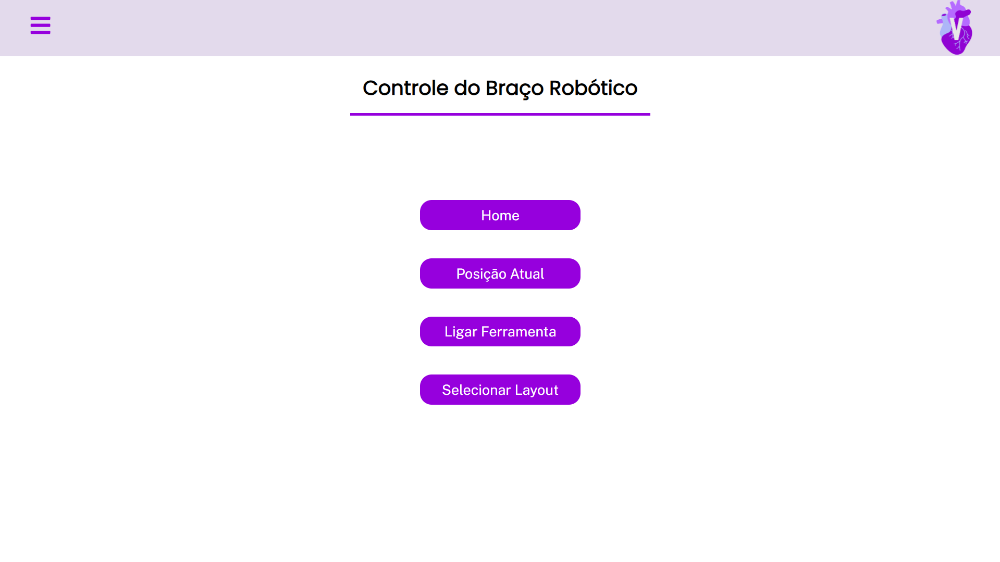
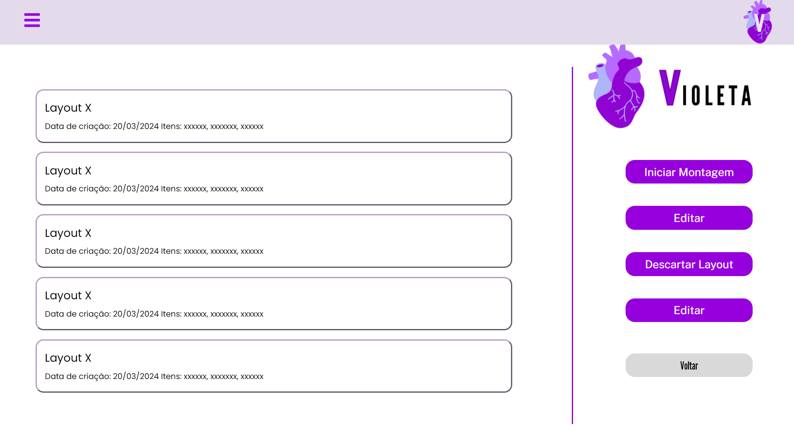
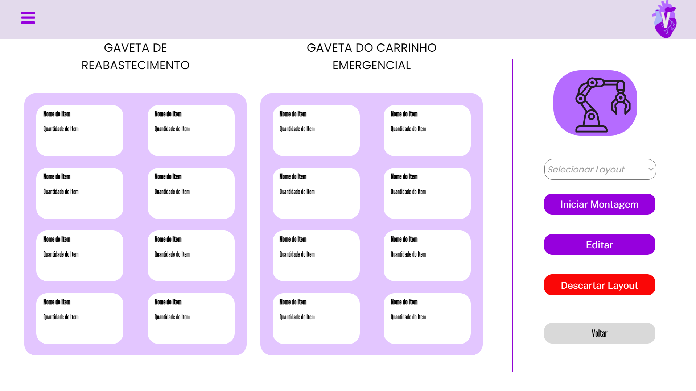
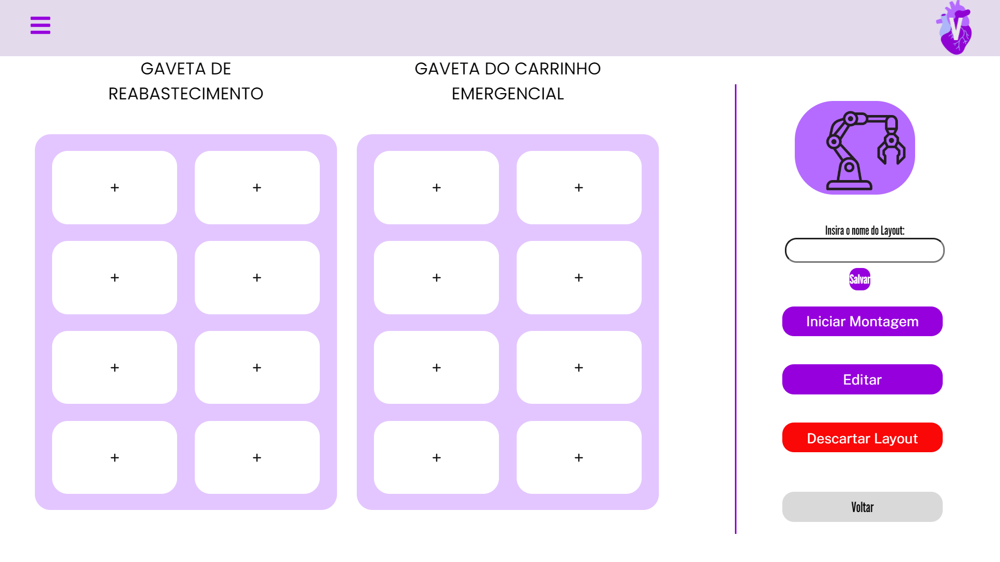

# Páginas

&emsp;&emsp;Durante a sprint 4, a equipe Violeta dedicou-se — também — a desenvolver o frontend da solução. Por isso, a equipe baseou-se no mockup desenvolvido ao longo das sprints anteriores para desenvolver as páginas da aplicação web da solução.

&emsp;&emsp;Por definição, "página", em uma aplicação web, é uma interface gráfica exibida numa tela com o intuito de exibir determinadas informações para um usuário. No contexto do projeto, as principais páginas a serem desenvolvidas são as referentes à visualização e à edição de layouts, cujo fluxo de navegação foi o principal foco da equipe na sprint 4.

&emsp;&emsp;A seguir, estão exibidas as páginas desenvolvidas durante a sprint e breve descrições sobre elas.

## Menu principal

<p style={{textAlign: 'center'}}>Figura 1 - Página de menu principal</p>



<p style={{textAlign: 'center'}}>Fonte: Elaboração própria</p>

&emsp;&emsp;A página de menu principal é a primeira página acessada pelo usuário ao iniciar a aplicação web da solução, logo após efetuar seu login. Nela, ela pode controlar o robô de braço robótico por meio do botão ```home``` (que faz o braço mecânico retornar a sua posição principal), por meio do botão ````posição atual``` (que exibe, na tela, a posição atual do braço mecânico) e por meio do botão ```ligar ferramenta``` (que liga ou desligada a ventosa fixa na extremidade do braço mecânico). Além disso, também há o botão ```Selecionar layout```, que redireciona o usuário para a página homônima.

## Selecionar layout

<p style={{textAlign: 'center'}}>Figura 2 - Página de selecionar layout</p>



<p style={{textAlign: 'center'}}>Fonte: Elaboração própria</p>

&emsp;&emsp;A página de selecionar layout exibe, por meio de uma lista de componentes, todos os layout armazenados na base de dados da solução. Nesses componentes, há informações breves sobre cada layout: nome, data de criação e itens contidos. Para selecionar um dos layouts exibidos, o usuário deve clicar no componente correspondente, o que o redirecionará para a página de layout selecionado.

## Layout selecionado

<p style={{textAlign: 'center'}}>Figura 3 - Página de layout selecionado</p>



<p style={{textAlign: 'center'}}>Fonte: Elaboração própria</p>

&emsp;&emsp;A página de layout selecionado exibe cada um dos compartimentos existentes no layout selecionado previamente pelo usuário, bem como os itens e as quantidades pré-definidas dentro de cada compartimento. No menu lateral da tela, há, ainda um menu de dropdown para selecionar um dos demais layouts exibidos na página anterior, um botão para dar início ao processo de montagem/reabastecimento do carrinho de emergência a partir do layout atual, um botão para editar o layout atual, um botão para descartar o layout atual e outro botão para voltar à página anterior.

## Montagem de layout

<p style={{textAlign: 'center'}}>Figura 4 - Página de montagem de layout</p>



<p style={{textAlign: 'center'}}>Fonte: Elaboração própria</p>

&emsp;&emsp;A página de montagem de layout permite que o usuário crie um novo layout a partir dos s de compartimento exibidos na tela. Ao clicar em qualquer um dos compartimentos, o usuário poderá definir o item que deve haver em tal compartimento e a quantidade deste. Quando finalizar a montagem deste layout, o usuário poderá nomeá-lo através do campo no menu lateral, que também contém um botão de ```Salvar``` para armazenar o layout no banco de dados da aplicação. Por fim, há ainda os botões ```Iniciar montagem```, ```Editar```, ```Descartar layout``` e ```Voltar```, que possuem as mesmas funções descritas de acordo com a página anterior.
