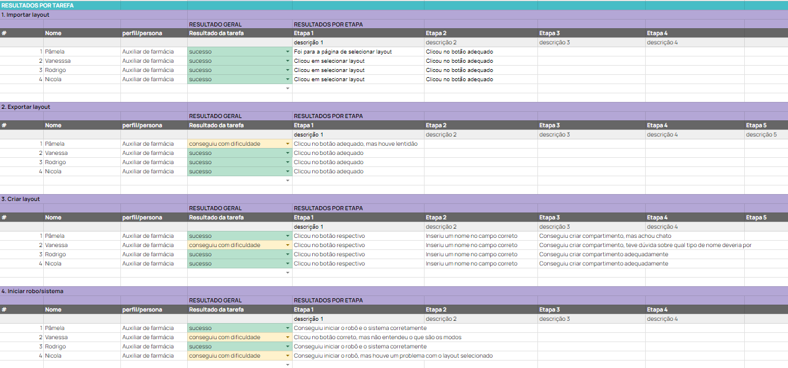
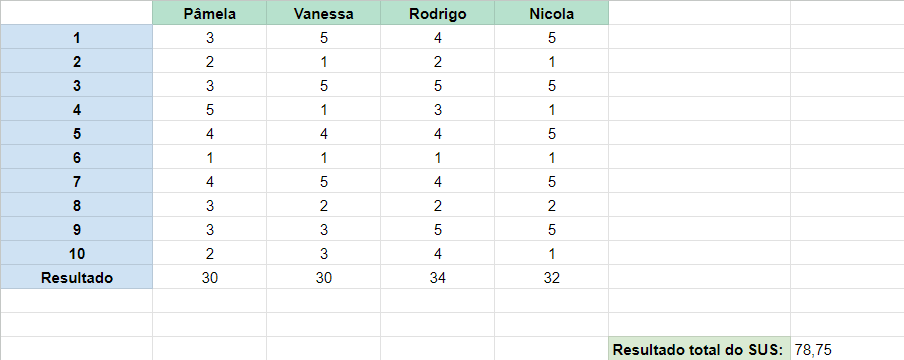
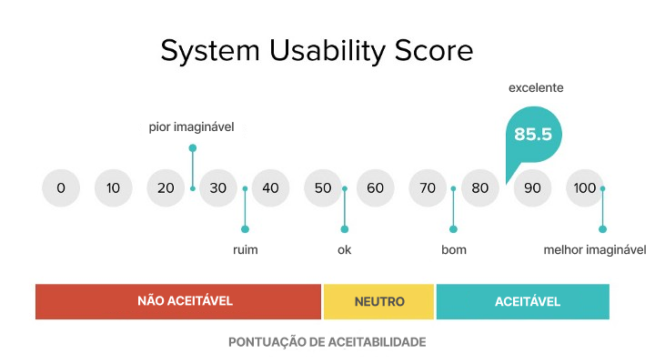

# Testes de usabilidade

&emsp;&emsp;Teste de usabilidade é uma técnica fundamental no desenvolvimento de sistemas, aplicativos e interfaces digitais. Trata-se de uma avaliação que busca compreender como os usuários interagem com um produto, analisando sua facilidade de uso, eficiência, satisfação e experiência geral durante a utilização.

&emsp;&emsp;A importância do teste de usabilidade reside no fato de que um sistema pode ser tecnicamente funcional, porém ineficaz se não for amigável para seus usuários. Afinal, a aceitação e o sucesso de uma aplicação dependem, em grande parte, da experiência do usuário. Se um sistema não for intuitivo, fácil de usar ou não atender às necessidades e expectativas dos usuários, corre o risco de ser abandonado rapidamente, independentemente de quão poderosas sejam suas funcionalidades.

&emsp;&emsp;Por meio do teste de usabilidade, é possível identificar problemas de design, navegação complicada, fluxos confusos, falhas de acessibilidade e outros obstáculos que possam dificultar ou impedir o uso eficaz do sistema. Ao detectar e corrigir esses problemas durante a fase de desenvolvimento, economiza-se tempo e recursos, além de garantir uma melhor experiência do usuário final.

&emsp;&emsp;Além disso, o teste de usabilidade ajuda a validar as decisões de design, confirmar se o produto atende aos objetivos do usuário e fornecer insights valiosos para o aprimoramento contínuo do sistema. Ao coletar feedback direto dos usuários, os desenvolvedores podem entender melhor suas necessidades, preferências e comportamentos, o que permite refinamentos iterativos e uma evolução constante do produto.

&emsp;&emsp;A seguir, tem-se o teste de usabilidade feito para o nosso sistema, o Violeta:

## Tabulação de testes de usabilidade

&emsp;&emsp;A tabulação dos resultados de testes de usabilidade é uma etapa crucial para organizar, analisar e interpretar os dados coletados. Essa organização eficiente facilita a identificação de pontos de melhoria e a tomada de decisões estratégicas para aprimorar a experiência do usuário. A tabulação de testes de usabilidade é o processo de organizar e resumir os dados coletados durante testes de usabilidade. Isso inclui a categorização dos problemas encontrados pelos participantes, a identificação de tendências e padrões nos dados, e a criação de um resumo claro e acessível dos resultados dos testes. Essa tabulação é essencial para extrair insights valiosos sobre a usabilidade de um produto ou sistema e para informar o processo de design e desenvolvimento.

&emsp;&emsp;A tabulação de testes a seguir tem o intuito de avaliar a usabilidade de maneira qualitativa.

Figura 1 - Testes de usabilidade

Fonte: Elaboração própria

&emsp;&emsp;A planilha possui o nome da pessoa que testou, a persona que está representando, o resultado (sucesso, conseguiu com dificuldade, não conseguiu), e quais etapas o usuário fez para completar a tarefa.

## System Usability Scale - Teste SUS

&emsp;&emsp;O System Usability Scale (SUS), que pode ser traduzido como Escala de Usabilidade do Sistema, é uma ferramenta amplamente utilizada para avaliar a usabilidade de sistemas, sejam eles softwares, websites, aplicativos móveis, ou qualquer outra interface homem-máquina.

&emsp;&emsp;Desenvolvido originalmente por John Brooke em 1986, o SUS é uma das medidas de usabilidade mais utilizadas e reconhecidas na área de experiência do usuário (UX). Ele consiste em um questionário simples e padronizado, composto por 10 itens, sendo que cada um é avaliado em uma escala Likert de cinco pontos, variando de "discordo totalmente" a "concordo totalmente".

&emsp;&emsp;Os itens do SUS abordam aspectos diversos relacionados à usabilidade do sistema, incluindo a facilidade de uso, aprendizagem, eficiência, memorabilidade e satisfação do usuário. Após os participantes responderem ao questionário, a pontuação total pode variar de 0 a 100, com pontuações mais altas indicando uma melhor usabilidade percebida.

&emsp;&emsp;O SUS é frequentemente utilizado em estudos de usabilidade para fornecer uma medida quantitativa da qualidade da experiência do usuário com um sistema específico. Ele é especialmente útil por sua simplicidade e eficácia na obtenção de feedback dos usuários, podendo ser aplicado em diferentes fases do desenvolvimento de um sistema para identificar pontos fortes e áreas de melhoria.

&emsp;&emsp;As perguntas feitas para calcular a escala de usabilidade do sistema foram as seguintes:

- Eu acho que gostaria de usar esse sistema com frequência.
- Eu acho o sistema desnecessariamente complexo.
- Eu achei o sistema fácil de usar.
- Eu acho que precisaria de ajuda de uma pessoa com conhecimentos técnicos para usar o sistema.
- Eu acho que as várias funções do sistema estão muito bem integradas. 
- Eu acho que o sistema apresenta muita inconsistência.
- Eu imagino que as pessoas aprenderão como usar esse sistema rapidamente.
- Eu achei o sistema atrapalhado de usar.
- Eu me senti confiante ao usar o sistema.
- Eu precisei aprender várias coisas novas antes de conseguir usar o sistema.

&emsp;&emsp;As respostas foram dadas de 1 a 5, sendo 1 "Discordo totalmente", e 5 "Concordo totalmente".

&emsp;&emsp;A seguir tem se o cálculo feito segundo o SUS.

Figura 2 - System Usability Scale

Fonte: Elaboração própria

&emsp;&emsp;O cálculo foi feito somando a resposta de cada participante, e realizando uma média simples entre as respostas, a partir disso, o resultado da média foi multiplicado por 2,5 (etapa solicitada pelo SUS)

Figura 3 - Escala do System Usability Scale

Fonte: UX Collective

&emsp;&emsp;De acordo com a escala do SUS, chegamos ao número 78.75, sendo assim ele está classificado entre "bom" e "excelente". Todavia, mesmo com uma boa classificação, fizemos melhorias no sistema de acordo com o *feedback* dos testes.

## Mudanças

- Popup explicando os modos de verificação: Implementamos uma explicação aos modos de verificação que podem ser escolhidos pelo usuário entre "modo 0", "modo 1", "modo 2" e "modo 3". Muitos usuários não entenderam do que se tratava os modos, sendo eles os modos de verificação sendo do 0 até o 3 o mais demorado mas também o mais seguro. Adicionamos então uma explicação do que é cada modo para o usuário saber mais assertivamente qual escolher.

- Layouts salvo automaticamente: Adicionamos o salvamento automático dos layouts que são feitos.

- Manter pressionado o botão de exportar: era necessário manter o botão de exportar pressionado, ajustamos ele para apenas ser necessário o clique.

- Fonte da quantidade de itens muito pequena: alguns usuários alegaram que a fonte da quantidade de cada item não estava tão visível, então aumentamos a fonte que a quantidade de cada item do layout aparece.

#### Observações

&emsp;&emsp;Por fim, é importante fazer uma observação. Os testes feitos foram em pequena escala, ou seja, poucas pessoas o testaram. Além disso, todas as pessoas tinham letramento digital intermediário ou avançado.

&emsp;&emsp;Entretanto, os testes feitos foram de extrema importância para encontrar elementos a serem melhorados que não havíamos encontrado antes.